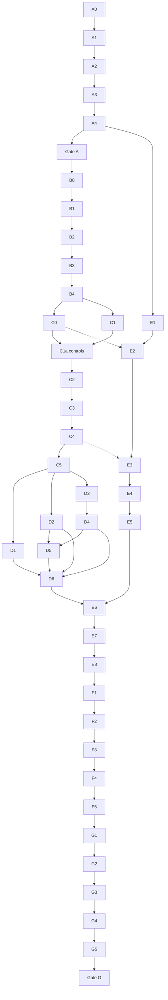

# Final Project — Autonomous Core Execution Plan

Status: **Phases A–E complete (Gate E PASSED); the deployment bundle is re-targeted to
Ubuntu Server 24.04 (E9, 2026-07-20 — the rented Pi's OS) with all three gates re-passed;
the conditional Pi trial (Phase F) is next.** comparison.jsonl holds all five (M0 FP32 /
M1 PTQ 0.3527 / M2 QAT 0.3832 /
M3 pruned-FP32 0.3583 / M4 pruned+QAT 0.373, 2.01 MB), all past P3/P4, all
`recall_floor_infeasible`. The pre-Pi shortlist is frozen: **M0 · M2 · M4**
(M1 dominated by M2/M4, M3 by M4), with `benchmark_val_1000.jsonl` and the
hash-locked `pre_pi_freeze.json` built. **Phase E is complete: E1–E8 DONE, Gate E
PASSED; E9 (2026-07-20) re-targeted the bundle Bookworm → Ubuntu 24.04 and re-passed all
three deployment gates on `ubuntu:24.04`.** E1 (Gate E1 PASSED) hardened the C++ foundation and exercised it against the
real M0 (leveled logging convention, `schema_version` on every output, build + ctest +
self-test/infer(native+QEMU)/benchmark/run-dataset all green on M0 in the target
container; `results/e1/e1_gate.json`). E2 certified the `Preprocessor` (fused +
reference paths, golden-fixture parity both ways, BGR-as-RGB rejected). E3 certified
`ModelSession` + `Policy` (contract validation, `ORT_ENABLE_ALL`/profiling/optimized-
graph, `mode: any` + hash binding, the full policy/threshold test matrix incl. the
`empty`-target rejection). E4 proved the dataset runner on M0 at corpus scale — **P4
PASSED** (`results/e4/p4_dataset_parity_m0.json`): confusion matrix identical on
cis_val_clean + trans_val, 0 hard decision disagreements; the residual FP32 score gap
is the P1 OpenCV-version drift (diagnosed, reported, not a bug). E5 closed the benchmark
+ system monitor (percentile-calculation unit test; the `performance_targets` report
with `measured_on_pi:false`; `results/e5/benchmark_m0.json`). **E6 is DONE — Gate E6
PASSED** (the real Phase-E measurement, done in pieces): (1) the pre-rental QEMU
`cortex-a76` ISA parity — `run-dataset` native vs emulated **bit-identical for M0/M2/M4**
(max Δ 0.0), contradicting the registered "FP32 moves" expectation, so no Pi-ISA
dispatch surprise is expected (`qemu_parity.json`); (2) the inference-pipeline
optimization matrix — decode the only latency knob with headroom (half 1.10×, quarter
1.17× on gx10, diagnostic), `threads=4` regresses, the rest within noise
(`optimization_matrix.json`); (3) the reduced-decode drift gate — **REJECTED** for the
whole shortlist (half/quarter lose real bobcat detections), so shipping stays full
decode (`decode_drift.json`); (4) native-vs-target — gcc 13/glibc 2.39 and gcc 12/glibc
2.36 both 5/5 + self-test, bit-identical decisions (`native_vs_target.json`); (5) Gate
E6 consolidation — every shortlisted model's P1–P4 chain passing and sha-bound, ALL/
EXTENDED graphs retained (`e6_gate.json`). E1–E5 were consolidation of A4/C4/P4; E6 is
new measurement. **E7** packaged the deployment bundle (frozen M0/M2/M4 + policies +
class map + a 47-frame sample slice + the pinned ORT + `install.sh`/`run_demo.sh`/
`run_benchmark.sh` + `BUNDLE.json` + `MANIFEST.sha256`); OpenCV is apt-installed by
`install.sh` (the imgcodecs closure is impractical to carry; the Pi's apt has the
matching `.406`), and the clean-container install test passed. **E8 — GATE E PASSED**:
the exact Pi commands run unattended in a clean container, the one-command benchmark
matrix includes the M0 baseline, machine-readable outputs parse. **E9 — deployment
re-targeted Bookworm → Ubuntu Server 24.04 (2026-07-20)** because the rented Pi runs
Ubuntu 24.04 (the provider offers no other image); build-env == deploy-env now, and all
three gates re-passed on `ubuntu:24.04` (E7 preflight 6/6, E7 bundle max GLIBC 2.38 ≤
2.39, Gate E dry run — diagnostic M0 13.62 → M2 7.25 → M4 6.10 ms p50 on gx10).
**Next: the conditional Pi trial (Phase F)** — one-shot, unscheduled, never early — then
Phase G (analysis, report, release). The next task is always the first `[ ]` in phase order.

This file converts [`DESIGN.md`](DESIGN.md) into executable work. It is the task
tracker for an implementation agent; `DESIGN.md` remains authoritative for every
technical decision, metric, acceptance threshold, and deliverable contract.

If PLAN and DESIGN ever disagree, stop and resolve the documents. Do not choose
one silently.

---

## 1. Document hierarchy and agent protocol

Read in this order:

1. [`README.md`](README.md) — project orientation, scope, and entry points.
2. [`DESIGN.md`](DESIGN.md) — complete technical and submission specification.
3. This file — task order, dependencies, outputs, and gates.
4. The newest `Handoff/HANDOFF_*.md` — current session state and deviations.

This file is the only task tracker. The next task is the first `[ ]` in phase
order; each completed task carries a dated note with what it established. A
second status board was tried and removed: it duplicated these checkboxes and
would have drifted from them.

The executing agent must follow these rules:

- use the dedicated `gx10` host for Phases A-E and G, including all data work,
  training, C++ work, shutter emulation, tests, dry runs, and deliverable builds;
- use the rented Raspberry Pi target (Pi 5 preferred, RPi 4 contingency) only for
  Phase F target-hardware verification and final measurements; never present
  `gx10` timings as Pi results;
- keep bobcat as the primary graded target while implementing generic target-set
  configuration over the 14 animal outputs; `car` and `empty` are not targets;
- work only on Core until Gate G passes;
- the only permitted post-Core Stretch is crop-teacher KD;
- mark a task complete only when its listed artifact exists and its checks pass;
- preserve commands, configs, logs, raw predictions, and raw timings;
- never reconstruct slide/report numbers manually;
- never evaluate models or make decisions from cis-test/trans-test labels before
  the freeze task; mechanical manifest/schema audits are allowed;
- use validation data for model/runtime/thread decisions;
- stop at a failed gate and fix the cause before continuing;
- keep all paths and commands non-interactive and rerunnable;
- update this plan and the newest handoff at the end of each work session.

### Completion states

- `[ ]` not started;
- `[~]` in progress;
- `[x]` completed and verified;
- `[!]` blocked, with the reason and evidence recorded in the newest handoff.

Do not use `[x]` for a partial implementation.

---

## 2. Fixed scope and critical path

Core is one full-frame MobileNetV2 with 16 outputs and a generic configurable
target policy, exported to ONNX and executed by a C++ ONNX Runtime application on
a Raspberry Pi 5. Bobcat remains the primary calibrated and graded target; target
selection never loads or runs another neural network.

Optimization candidates:

- M0 — FP32 baseline;
- M1 — INT8 PTQ;
- M2 — INT8 QAT;
- M3 — structured-pruned FP32;
- M4 — structured-pruned + QAT.

Dependency overview:



A4 implements the minimal interfaces later hardened by E1-E5 against trained M0
and the optimized shortlist. No Pi bundle is frozen before D6 produces the
complete deployable shortlist.

The dotted edges are the ones easiest to miss when reading the solid chain as the
critical path: E1 may indeed start right after A4, but E2 cannot be finished before
C0 freezes the golden fixtures and E3 cannot be finished before C4 exports a real
model. The E chain therefore overlaps phases B-D rather than preceding them.

---

## 3. Phase A — repository and toolchain

### A0 — Record starting state

- [x] Confirm access to the dedicated `gx10` working copy and capture
      `git status`, current branch/commit, disk space, CPU/GPU, ARM64 architecture,
      OS, CUDA, compiler, and available persistent-job mechanism.
- [x] Preserve unrelated user changes.
- [x] Create a dated run/session log.

**Output:** `results/provenance/project_start.json` and newest handoff update.

**Done 2026-07-15.** Captured by `scripts/capture_provenance.py`; run log at
`results/provenance/RUNS.md`. Key facts that shape later tasks:

- gx10 is Ubuntu 24.04 / **glibc 2.39**. *(A0 originally noted a Pi OS Bookworm target
  at glibc 2.36 and picked a `debian:bookworm-slim` container. **Superseded by E9,
  2026-07-20:** the rented Pi runs **Ubuntu Server 24.04** — the same glibc 2.39 as gx10
  — so the target container is now `ubuntu:24.04` and build-env == deploy-env; there is no
  cross-glibc forward-compat bet left to make.)*
- gx10 CPU is Cortex-X925 + A725 with `i8mm`, `sve`, `sve2`. Pi 5 Cortex-A76 has
  none of these. This is the measured basis for the DESIGN §12.2 parity strata.
- 20 cores, GB10 / CUDA 13.0 / torch 2.11.0+cu130, 502.8 GiB free, 117.8 GiB RAM
  available after the boreal stack was stopped (see DESIGN §4 operational note).
- `torch-pruning 1.6.1` is already present. `onnx`, `onnxruntime` and `opencv` are
  not — A2 installs them.
- gx10 commits and pushes directly over SSH using a dedicated repo-scoped deploy
  key (`~/.ssh/id_ed25519_efficientml`, host alias `github-efficientml`,
  `IdentitiesOnly yes`). Write access verified. The `~/.netrc` HTTPS token is
  read-only and is no longer used for this repository. Commit as
  `Vadym <imagic9@gmail.com>` from either machine.

### A1 — Create repository skeleton

Depends on: A0.

- [x] Create the package, configs, C++ directories, scripts, tests, notebooks,
      data-manifest directories, artifact directories, results, report, slides,
      demo, and deployment directories specified by DESIGN §14.
- [x] Add `.gitignore` rules for datasets, caches, credentials, build outputs,
      large checkpoints, and temporary benchmark files.
- [x] Add placeholder `SUBMISSION.md`, `CITATION.cff`, license, and artifact/data
      READMEs.
- [x] Establish Python and C++ test commands.

**Done when:** a clean checkout has an understandable structure and empty test
suites execute successfully.

**Done 2026-07-15.** Test commands, both verified on `gx10`:

```bash
python -m pytest tests/python                 # 28 passed
cmake -S cpp -B build -DCMAKE_BUILD_TYPE=Release
cmake --build build -j8
ctest --test-dir build --output-on-failure    # 1/1 passed
```

Notes for later phases:

- The issue #3 `.gitignore` fix is now proved on a live tree, not on hypothetical
  paths: `src/wildlife_trigger/data/`, `configs/data/` and `data/manifests/` all
  stage correctly.
- `cpp/` ships a real `cpu_features` library, not a stub, and it is the first
  thing wired through the emulation harness. Verified: the **same binary** reports
  `asimd,asimddp` under `qemu-aarch64 -cpu cortex-a76` and
  `asimd,asimddp,sve,sve2,i8mm,bf16` natively. That divergence is exactly the
  mechanism by which ORT will select different kernels, so the E6 rehearsal rests
  on a harness that is already known to work.
- CMake **rejects** `-mcpu=native` unless `WILDLIFE_ALLOW_NATIVE=ON`; verified it
  fires. Building with `-DWILDLIFE_CPU_TARGET=cortex-a76` works.
- No C++ test framework and no vendored `nlohmann/json` yet. Both are deferred to
  E1, when there is behaviour to assert and a caller that reads JSON;
  `cpp/third_party/README.md` records the no-network vendoring contract.
- `LICENSE` is MIT with Vadym as copyright holder.

### A2 — Reproducible environments

Depends on: A1.

- [x] Define the isolated `gx10` Python/GPU training environment.
- [x] Define the `gx10` CPU-only C++/ONNX Runtime development environment.
- [x] Define a clean target-compatible ARM64 container on `gx10` for Pi build,
      bundle-install, and full dry-run checks.
- [x] Record the target distro/glibc/compiler contract, pin the matching container
      base by digest, and add `ldd` plus required-`GLIBC_*` symbol checks. If exact
      compatibility cannot be proved, make the pinned on-Pi source build the
      deployment path. *(A2 originally used a `debian:bookworm-slim` base for a Pi OS
      Bookworm target; **E9, 2026-07-20** re-targeted to `ubuntu:24.04` — the rented Pi
      runs Ubuntu Server 24.04, glibc 2.39, same as gx10 — so build-env == deploy-env
      and the base now matches the Pi exactly.)*
- [x] Install and pin `qemu-user` in that container for ISA-level checks. A0
      measured `-cpu cortex-a76` advertising exactly the Pi 5 feature set
      (`asimd`+`asimddp`, no `sve`/`sve2`/`i8mm`/`bf16`) and `-cpu cortex-a72` the
      Pi 4 one (no `asimddp`). ORT dispatches kernels from these bits at runtime, so
      emulation reproduces the Pi's kernel choice and numerics. It reproduces
      **nothing** about latency — no emulated timing enters a results table.
- [x] Pin compiler, CMake, OpenCV, ONNX, ONNX Runtime, and Python dependencies.
- [x] Add environment-capture tooling and resolved run-config serialization.
- [x] Add checkpoint/resume and persistent logging for every long-running job.
- [x] Verify no secret, SSH key, token, or dataset credential is committed.

**Outputs:** lockfile(s), environment setup scripts, and environment JSON schema.

**Done 2026-07-15.** All pins live in `configs/env/pins.env`, the
single source of truth both the Dockerfile and the setup scripts read.

*ORT is not a compatibility risk.* The official aarch64 tarball needs at most
`GLIBC_2.27` / `GLIBCXX_3.4.21` and links only standard system libraries — far
below the target's 2.39. One identical ORT binary therefore serves the gx10
container and the Pi, which is the cheapest de-risking available. Re-verify on any
bump: it is a property of their build, not a promise.

*Version alignment is a parity concern, not hygiene.* The first resolve produced
Python ORT 1.27.0 against C++ 1.27.1, and Python OpenCV **5.0.0** against C++
4.6.0. P3 compares ORT Python with ORT C++, and P1 compares the two preprocessing
implementations — under a version split both gates would still pass or fail, but
about the distance between two upstream releases rather than between our own two
call sites. ORT is now 1.27.0 on both sides (PyPI publishes no 1.27.1 wheel;
matching beats newer). OpenCV Python is pinned to the newest 4.x.

*One gap is left open on purpose.* C++ OpenCV stays at the Pi's apt 4.6.0 (Ubuntu
24.04's `libopencv-*406t64`), against Python's 4.13. Only the `INTER_LINEAR`
resize could differ — decode, BGR→RGB, pad, scale and normalise are trivially
defined. **P1 must quantify it**; if drift exceeds tolerance, the answer is to
build a matching OpenCV in the container and bundle those `.so` to the Pi. Measure
before deciding.

*The training venv is isolated on purpose.* Not `~/efficientml/venv`, which sets
`include-system-site-packages=true` and inherits ~5 GB from `~/.local`; a lockfile
from there would describe an environment we neither control nor can reproduce.
`setup_gx10.sh` asserts the isolation before installing and fails if CUDA is
missing rather than silently training on CPU.

**Verified state.** *(A2 originally verified against a bookworm target on 2026-07-15;
**E9 re-targeted the C++ column to Ubuntu 24.04 on 2026-07-20** — the rented Pi's OS —
so the table now reflects `ubuntu:24.04`. glibc between gx10 and the Pi is now the same.)*

| | Python (`~/venvs/wildlife_trigger`) | C++ (`wildlife-trigger-target:ubuntu2404`) |
|---|---|---|
| ONNX Runtime | 1.27.0 | 1.27.0 |
| OpenCV | 4.13.0 | 4.6.0 (Ubuntu 24.04 apt, `libopencv-*406t64`) |
| torch | 2.11.0+cu130, CUDA on GB10 cap 12.1 | — |
| glibc | 2.39 (gx10) | **2.39**, matching the Pi's Ubuntu 24.04 |
| compiler | — | gcc 13, cmake 3.28 |

Commands:

```bash
scripts/setup_gx10.sh              # isolated venv + requirements.lock (49 pins)
scripts/build_target_container.sh  # ubuntu:24.04 image, ORT verified at build time
scripts/verify_target_env.sh       # the A2 gate, unattended
python -m pytest tests/python      # green
```

`verify_target_env.sh` proves, end to end: our binary and libonnxruntime resolve
against the target glibc (E9 re-validation: max GLIBC required 2.38 ≤ 2.39); ORT links,
reports 1.27.0 and constructs a session **under `qemu -cpu cortex-a76`**. So the ISA
rehearsal works with real ORT, not only with the probe.

Secrets audit: no key material or credential-shaped string anywhere in history,
not merely at HEAD. A dotfile `.env` is now ignored — deliberately `.env` and not
`*.env`, since `configs/env/pins.env` must be committed — and the token-pattern
check is a test rather than a one-off.

**Resolved in E7, re-confirmed in E9:** OpenCV soname. E7's decision (bundling the `.so`
was ruled out — `libopencv_imgcodecs` drags a ~50-library GDAL/poppler/database closure):
`install.sh` apt-installs the OpenCV 4.6.0 runtime. On the rented Pi's **Ubuntu 24.04**
that runtime is `libopencv-*406t64` (E9, 2026-07-20) — the same 4.6.0 with the
byte-compatible `.406` soname the binary linked against (verified in a fresh
`ubuntu:24.04` container). A wrong-OS host (different glibc/soname) is refused by
`preflight.sh`; the rebuild-on-the-Pi contingency is documented in `deploy/pi/README.md`.

### A3 — P0 toolchain spike

Depends on: A2.

- [x] Export ImageNet-pretrained MobileNetV2 FP32 to ONNX at provisional opset 17;
      explicitly reject the legacy opset-9 spike artifact.
- [x] Create a small static PTQ ONNX model.
- [x] Choose the QAT library here rather than assuming one. Try, in DESIGN §8.2
      order, direct QDQ fake-quant + `torch.onnx.export`, then NVIDIA
      `pytorch-quantization`, then `torchao`; stop at the first that yields a QDQ
      graph ORT executes as integer. Record every rejected candidate and its
      failure — that is P0 evidence and belongs in the report.
- [x] Run one epoch/minimal step of the chosen QAT path and export deployable
      INT8 ONNX.
- [x] On `gx10`, load all three models with the exact planned C++ ORT build
      inside the target-compatible ARM64 environment.
- [x] With the C++ API, start from `ORT_ENABLE_ALL`, call
      `SessionOptions::EnableProfiling(prefix)`, save the session-optimized graph,
      and run a fixture. Save profiles plus operator/data-type coverage; do not use
      one fused-node name as the sole proof of INT8 execution.
- [x] Verify FP32/PTQ/QAT use the same P0-accepted opset. Compare
      `ORT_ENABLE_EXTENDED` later only as an explicitly named E6 candidate.
- [x] Re-run all three models under `qemu-aarch64 -cpu cortex-a76` in the same
      container. Confirm integer execution survives without `i8mm`/`sve2` and record
      the operator/data-type coverage ORT picks instead. A QAT path that only works
      because gx10 has `i8mm` is a **P0 failure**; this is the cheapest place to
      find that out.
- [x] Pin versions only after FP32/PTQ/QAT all work end to end, natively and under
      `-cpu cortex-a76`.

**Output:** P0 evidence that all three model forms execute in ARM64 C++ and the
QAT artifact is genuinely quantized.

**Done 2026-07-15.** `scripts/run_p0_spike.sh` runs the whole gate unattended; all
16 checks pass (`results/p0/p0_gate.json`). One command reproduces every claim
below.

*The QAT library question is answered, and the answer is that it was the wrong
question.* Candidate 1 (DESIGN §8.2's first) works, so `pytorch-quantization` and
`torchao` were never installed. But the first attempt at candidate 1 **failed** in
exactly the way §8.2 warns about — a float graph carrying rounded weights: 45
FusedConv + 5 Conv still running float, only 2 of 52 convolutions quantized. The
cause was not the library. Fake-quant on the convolution *input* is what every
TensorRT-oriented library emits, and ORT's float-level ConvActivationFusion reaches
`Conv + Clip -> FusedConv` before the QDQ rule can match `DQ -> Conv -> Q`.
Candidates 2 and 3 place QDQ the same way and would have reproduced the failure
with more dependencies. **The axis that mattered was QDQ placement against ORT's
fusion rules, not the library.** This belongs in the report's "what did not work".

What P0 established, all measured, none assumed:

| Fact | Evidence |
|---|---|
| M1 PTQ and M2 QAT both execute as **integer** in C++ ORT, natively and under `-cpu cortex-a76` | `p0_gate.json`, 16/16 |
| The QAT and PTQ **optimized graphs are identical** — `QLinearConv:52, QLinearAdd:10, QGemm:1, QLinearGlobalAveragePool:1` | `*.coverage.json` |
| Integer execution **survives the loss of `i8mm`/`sve2`**; the emulated CPU reports `asimd,asimddp` and `looks_like_pi5=true` | `*.cpp-qemu.probe.json` |
| M0 FP32 does **not** report integer execution (the negative control) | `fp32_stays_float` |
| C++ and Python ORT are both **1.27.0** and agree on argmax over a shared fixture blob | `*.probe.json` |
| All three forms carry **opset 17** *after* PTQ/QAT rewrote the graph | `opset_parity.json` |

Three findings that cost real time and would have cost more later:

- **ORT requires rank-0 QDQ scales.** torch exports per-tensor scale/zero-point as
  shape `[1]`. ORT refuses the graph outright — and `onnx.checker.check_model` with
  `full_check=True` passes it. `optimize/qdq_scalar.py` repairs the rank and only
  the rank. A structural check would have shipped this artifact.
- **ReLU6 must be absorbed into the activation quantizer**, not left between Conv
  and Q. This is exact rather than convenient (a quantizer over `[0, m<=6]` already
  clamps as ReLU6 does), and `verify_relu6_removal_is_exact` measures it at 0.0
  difference rather than arguing it. ORT's own PTQ quantizer does the same removal.
- **The classifier's Gemm needs its flattened input quantized.** `torch.flatten`
  sits between the pooled vector's quantizer and the Gemm, so nothing else can
  reach that tensor; without it every convolution ran integer around a float
  classifier.

Two bugs found in this task's *own* checks, worth recording because both passed
while proving nothing:

- the Python/C++ agreement check compared the C++ blob against the C++ probe's own
  report — C++ against itself — while Python was separately generating a different
  input. Both call sites now read one shared fixture blob, and the gate refuses to
  compare unless they did.
- `ort_coverage` exited 1 both when a model was not integer and when ORT could not
  load it, leaving a **stale report** on disk that read as a plausible result. Exit
  codes are now 0/2/1 (integer / not-integer / could-not-run) and the report is
  written even on failure.

**Reproducibility:** `nn.Dropout` in the classifier draws from torch's *global* RNG,
so the QAT export differed on every run (argmax 21, then 908) despite seeded data
generators. Seeded in `optimize/qat.py`; two consecutive exports now produce
byte-identical SHA-256.

**Left for later:** ORT warns that a session-optimized graph serialized above
`ORT_ENABLE_EXTENDED` "should only be used in the same environment the model was
optimized in" — so the optimized graphs here are evidence of what ORT *chose*, and
**must never be shipped to the Pi as artifacts**. E6/E7 ship the ordinary model and
let the Pi optimize it. PTQ/QAT accuracy is meaningless here by construction: both
used synthetic data, because no CCT download is permitted before Gate A.

### A4 — Mandatory early C++ vertical slice

Depends on: A3. This task implements the minimal smoke subset of E1-E5.

- [x] Export a deterministic 16-output smoke model and class map.
- [x] Run saved JPEG -> C++ decode/preprocess -> ORT -> generic policy ->
      `SHUTTER_TRIGGER` JSON.
- [x] Produce schema-valid per-stage benchmark JSON and system-monitor output.
- [x] Build and install a provisional ARM64 deployment bundle in the clean
      target-compatible environment.
- [x] Preserve the exact command, output, ORT profile, and bundle checksum.

**Done 2026-07-15.** `scripts/run_a4_slice.sh` runs the whole slice unattended; all
29 checks pass (`results/a4/a4_gate.json`).

*The slice earned its keep on its first run.* It failed immediately, with the model
contract check refusing to infer: the smoke model had been exported at ImageNet's
224x224 while the application defaults to DESIGN §5.5's provisional Core input of
256x192. That mismatch would otherwise have surfaced during C1a — after training —
as a model that silently could not be deployed. Both now read
`INPUT_SHAPE_PROVISIONAL_CORE` from one place. This is the entire argument for
building a vertical slice before the data exists, and it paid on day one.

What A4 established:

| Fact | Evidence |
|---|---|
| Full path works: JPEG -> C++ decode/preprocess -> ORT -> policy -> `SHUTTER_TRIGGER` JSON | `evidence/infer.native.json` |
| The path runs under **`-cpu cortex-a76`** and agrees with the native run's decision | `evidence/infer.qemu.json` |
| The policy loader **refuses all 12 invalid policies through the real CLI**, not only in ctest | `evidence/policy_rejections.json` |
| A multi-target policy works on the same model with **no reload** (DESIGN §4) | `evidence/infer.multi_target.json` |
| Benchmark JSON is schema-valid; p50<=p95<=p99 holds for every stage | `evidence/benchmark.native.json` |
| Absent sensors report **`"unavailable"`**, never 0 | same |
| Bundle: 7 files, checksums verify, **max GLIBC 2.34 <= the Pi's 2.36** | `evidence/bundle_audit.json` |
| The staged bundle runs its own self-test from its own launcher | `evidence/bundle_self_test.json` |

Judgement calls:

- **`nlohmann/json` 3.12.0 vendored now**, not in E1. `third_party/README.md` said to
  wait for a caller that reads JSON; A4's policy loader is that caller. GitHub
  publishes no digest for the asset, so the hash was cross-checked by fetching the
  same header from the tagged repo tree and confirming byte-identity — weaker than a
  signed digest, and the strongest thing upstream offers. `scripts/verify_vendored.sh`
  re-checks it as a gate.
- **SHA-256 is implemented in-tree** (`cpp/src/hashing.cpp`) rather than linking
  OpenSSL or vendoring a second dependency for ~60 lines. The only need is binding a
  policy to a model by hash — no secrets, no adversary. Tested against the NIST
  vectors including the multi-block padding case.
- **The session-optimized graph is deliberately not bundled**, per P0's finding that
  ORT considers it valid only in the environment that produced it.
- **OpenCV is not bundled** — `install.sh` apt-installs it; the Pi's Ubuntu 24.04 gives
  the matching 4.6.0 / `.406` (`libopencv-*406t64`), and preflight refuses a wrong OS.
- The fixture JPEG is **synthetic** and says so; a bright shape sits near the frame
  edge so a centre-cropping preprocessor would visibly lose it.

**Gate A:** P0 passes and the thin C++ inference/benchmark/deployment path works
end to end before data preparation or long training.

**PASSED 2026-07-15**, 45 checks across both gates (`results/gate_a.json`):

```bash
python -m wildlife_trigger.validate.gate_a \
    --p0 results/p0/p0_gate.json --a4 results/a4/a4_gate.json
# PASS P0 (16 checks) · PASS A4 (29 checks) -> GATE A PASSED
```

Phase B (CCT-20 download) and Phase C (long training) are now permitted. Neither was
started before this passed.

---

## 4. Phase B — data

### B0 — Acquire and fingerprint sources

Depends on: Gate A.

- [x] Download `eccv_18_annotations.tar.gz` (3 MB) for the official CCT-20 splits.
- [x] Download `eccv_18_all_images_sm.tar.gz` (6 GB), capped at 1024 px per side.
- [x] Download `caltech_camera_traps.json.zip` (9 MB) for empty-supplement
      selection. Do not download `cct_images.tar.gz` (105 GB) or the bounding boxes
      (35 MB, Stretch KD only).
- [x] Record URLs, timestamps, file sizes, and SHA-256 hashes.
- [x] **Record the observed image-dimension distribution of every split** and
      confirm the dominant frame against DESIGN §5.5. The input-shape argument and
      the reduced-decode alignment both rest on these numbers; neither may be
      inherited from the paper or from DESIGN.
- [x] Verify licensing/citation text for README/report/model card.

Budget roughly 8.1 GB of downloads and about 40 GB of working disk on `gx10`
(archive plus extraction plus artifacts).

**Outputs:** `data/README.md`, source manifest, checksums, and the split dimension
report.

**Done 2026-07-15.** Downloaded 6.50 GB total from LILA, now served from Google
Cloud Storage (`storage.googleapis.com/public-datasets-lila/...`) — the URL is
recorded per run because LILA has rehosted before. Hashes in
`data/raw/source_manifest.json`; the 105 GB archive and the bboxes were not fetched.
Licence: Community Data License Agreement (permissive variant).

**DESIGN §5.5 is now measured rather than inherited.** The annotation JSON records
the *original* geometry (2048x1494) and could never have answered this — the `_sm`
archive is capped at 1024 px, so the frames we actually decode are different files.
`data/dimensions.py` reads all 57,864 JPEG headers:

| Claim | DESIGN said | Measured |
|---|---|---|
| dominant decoded frame | 1024x747 | **1024x747** |
| its share of the corpus | ~91% | **91.4%** |
| `_sm` long-side cap | 1024 | **1024** (max observed) |
| unreadable frames | — | **0 of 57,864** |

So the 256x192 input choice and the `1024 / 4 = 256` reduced-decode alignment both
rest on the real corpus. Per-split dominance varies (trans-val is 100% 1024x747,
cis-test 89.7%), which is why the aspect-ratio argument is made against the corpus
rather than one split.

### B1 — Build official split manifests

Depends on: B0.

- [x] Parse train, cis-val, cis-test, trans-val, and trans-test JSON.
- [x] Freeze the exact 16-class order in `configs/data/classes.yaml`.
- [x] Assert the class set is 14 animals plus `car` and `empty`; mark only the 14
      animal classes as selectable policy targets.
- [x] Emit deterministic JSONL manifests with complete `labels`, optional
      `primary_label`, location, sequence, dimensions, and source metadata.
- [x] Reconcile counts to 13,553 / 3,484 / 15,827 / 1,725 / 23,275.
- [x] Fingerprint the official train/cis-val overlap as exactly 224 sequences,
      270 cis-val images, and 10 bobcat images.
- [x] Generate immutable `cis_val_clean.jsonl` with 3,214 images / 144 bobcat
      images by removing every train-overlapping `seq_id`.

**Outputs:** five versioned manifests plus category/location summaries.

**Done 2026-07-15.** Every number DESIGN pinned reconciles **exactly** against the
downloaded JSONs — no adjustment, no rounding:

| | Expected | Observed |
|---|---|---|
| split counts | 13,553 / 3,484 / 15,827 / 1,725 / 23,275 | all match (57,864 total) |
| train↔cis-val overlap | 224 seqs · 270 imgs · 10 bobcat | **exact** |
| `cis_val_clean` | 3,214 imgs · 144 bobcat | **exact** |
| trans-val bobcat (§4 table) | 793 | 793 |
| multi-class train images | "the seven" (B3) | 7 |

That the leakage fingerprint lands on all three numbers is the real result: it means
LILA has not republished the metadata, and DESIGN's §5.3 analysis was done against
this exact data.

**The class order is frozen: ascending CCT category ID**, which puts `bobcat` at
index 3. Derived from the dataset rather than chosen, so it is traceable and
deterministic; `car` (12) and `empty` (11) are marked non-selectable per DESIGN §4.
The IDs are sparse (1, 3, 5, ... 99), so "the 16 classes" was not an order until
this froze one — and every calibrated threshold binds to an index, so changing it
later would silently rebind thresholds to different animals.

The first generated `classes.yaml` was **malformed** (a flow mapping missing a comma
after the padded name), which parsed as nonsense rather than failing. The writer now
parses back what it wrote and asserts a round-trip. A generated config that does not
load is a bug that surfaces far from its cause.

**Note for C:** the A4 smoke `class_map.json` used a placeholder alphabetical order
and is now superseded — the real class map must be generated from `classes.yaml`.
A4's artifacts were explicitly marked provisional for exactly this reason.

### B2 — Build `cct_empty_train_v1`

Depends on: B1.

- [x] Extract all 20 CCT-20 location IDs.
- [x] Select exactly 5,000 full-CCT `empty` images from locations disjoint from
      all 20, stratified across locations/sequences with seed 42.
- [x] Download selected images only (~2.1 GB, served at original resolution).
- [x] **Downsize every image to max 1024 px per side** per DESIGN §5.2 step 7,
      matching the `_sm` archive. Record the resampling filter and JPEG quality in
      the data config. Without this the supplement arrives at ~2048 px while every
      CCT-20 split is 1024 px, making resolution a shortcut feature perfectly
      correlated with `empty` — and one that fails silently, because val/test
      contain only `_sm` frames.
- [x] Compute original and downsized checksums; emit the supplement manifest with
      both dimension sets.
- [x] **Run the supplement-versus-CCT-20 shortcut probe.** Train a small binary
      classifier to separate the two pools. Near chance means the confound is
      closed; a materially higher score blocks training and is recorded.
- [x] Confirm no selected image ID, sequence, or location leaks into CCT-20.

**Output:** frozen `cct_empty_train_v1.jsonl`, checksums, and the shortcut-probe
result.

**Done 2026-07-15.** 5,000 empty frames from 106 locations / 3,044 sequences, seed 42,
max single-camera share **4.4%**. All fetched, 0 failures, 4,955 downsized (45 were
already within the cap and are re-encoded anyway — uniform treatment, so no frame gets
one JPEG generation while its neighbour gets two). 1.16 GB on disk.

**Shortcut probe: 0.5775 held-out accuracy against a chance of 0.50** — below the 0.60
attention threshold, so the resolution/encoding confound is closed as far as the probe
can tell. The residual ~8% is consistent with the *unavoidable* location-disjoint
background difference (rule 3), which the probe cannot distinguish from encoding by
construction. The report says so rather than claiming the supplement is pristine.

**A silent bug that would have voided rule 3 entirely.** The two metadata files disagree
about a type: full CCT stores `location` as a string (`"26"`), CCT-20 as an integer
(`38`). So `image["location"] in cct20_locations` is `"26" in {26, 38}` — **False for
every image**. Rule 3 would have been disabled and the supplement drawn from the very
cameras it must avoid, with nothing crashing. Measured: the raw comparison finds 0
overlapping images, the normalised one finds 32,255. Fixed by `normalise_location`, and
the selector now **refuses to proceed if rule 3 rejects zero candidates** — because zero
is not a clean dataset, it is a broken comparison. It now rejects 3,917.

**Azure is 18x slower than GCP for per-image fetches**, and the retry loop was hiding it.
Measured from gx10 over 48 concurrent images: Azure 40 img/min with 4 of 48 failing, GCP
740 img/min with none, GCP at 48 workers 2,144 img/min. The full 5,000 would have taken
**over two hours** on Azure and took ~4 minutes on GCP. LILA mirrors the same bytes on
GCP, AWS and Azure; all three are recorded in `LILA_IMAGE_MIRRORS`. Re-measure rather
than inherit this.

### B3 — Implement data and preprocessing code

Depends on: B1, B2.

- [x] Implement dataset readers and manifest validation.
- [x] Exclude the seven distinct-class multi-label train images from CE while
      retaining full label sets for target-presence evaluation.
- [x] Implement canonical aspect-preserving resize/pad/RGB/NCHW/ImageNet
      normalization from DESIGN §5.5.
- [x] Implement training-only photometric augmentation without animal-removing
      crops.
- [x] Make validation/test preprocessing deterministic.
- [x] Build the offline preprocessing cache (DESIGN §5.5): steps 1-4 computed once
      into per-shape uint8 letterbox arrays, so training does not re-decode 57,864
      JPEGs every epoch of every run. Sound only because the augmentation list has
      no random crop/resize; the cache builder must call the *same* preprocessing
      code path the C++ application uses, must not re-encode to JPEG, and must be
      keyed by a hash of the preprocessing config plus source manifest and verify it
      on load. A cache that outlives its config trains on stale pixels and nothing
      downstream can detect it.
- [x] Add unit tests for manifests, labels, missing/corrupt files, and transforms.
- [x] Test that the cache builder and the on-the-fly path produce **identical**
      tensors, and that a changed preprocessing config invalidates the cache rather
      than being ignored.

**Output:** tested Python data package, resolved data config, and a
config-fingerprinted preprocessing cache.

**DONE — checkboxes reconciled 2026-07-20.** The implementation
(`src/wildlife_trigger/data/{dataset,preprocess,cache,manifests}.py`) shipped back in
Phase B and has trained every model since (C0-E8 all depend on it); the boxes had
simply never been ticked. Reconciled after re-verifying against the code and the test
suite. The two *test* bullets — the genuine gap the Session-13 handoff flagged — are
now closed by `tests/python/test_cache.py` (11 tests): cache row is **bit-identical**
to the on-the-fly `letterbox_bgr` path (direct and end-to-end through `WildlifeDataset`);
a changed geometry is a separate cache; a changed `pad_value`/manifest/row-order is
**refused as stale** (both `open_cache` and the dataset raise, never serve stale
pixels); `decode` raises on missing/corrupt files; the augmentation is shape-preserving
and seed-deterministic. B3-relevant subset green on gx10 (49 passed:
`test_cache`, `test_preprocess_geometry`, `test_p1_preprocess`, `test_dataset_semantics`,
`test_calibration_manifest`, `test_golden_tensors`).

### B4 — Data audit gate

Depends on: B3.

- [x] Implement every assertion in DESIGN §5.3.
- [x] Produce class, location, sequence, split, and supplement statistics.
- [x] Verify multi-label counts 7 / 0 / 1 / 61 / 9 across the five official
      splits and test target-presence semantics.
- [x] Emit the per-class validation support table (images and sequences on
      cis-val-clean and trans-val) and assert that the animal classes with zero
      validation positives are exactly `deer` and `fox`, while `badger` has
      exactly one positive image / one sequence. Record all three as unavailable
      targets with null thresholds.
- [x] Render/inspect representative RGB, IR-like, empty, bobcat, small, portrait,
      and landscape samples. **DONE 2026-07-20** — a deterministic 6-frame gallery
      (daytime-RGB animal, night-IR, CCT empty, supplement empty, trans-val bobcat,
      small bobcat with a scaled train bbox showing why no centre-crop) plus a
      letterbox demo rendering the dominant 1024×747 frame at 97.4% utilisation vs
      224×224's 72.8%, using the real `preprocess.py` path.
- [x] Complete and execute `notebooks/01_data_audit.ipynb` from a clean kernel.
      **DONE 2026-07-20** — built by `scripts/build_notebook_01_data_audit.py`,
      executed on gx10 through `jupyter nbconvert --execute` (clean kernel, 15 code
      cells, 9 figures, 0 errors). Reads only frozen artifacts; touches no test
      labels (DESIGN §5.4); the final cell asserts the Gate B artifact still passes.
- [x] Store machine-readable audit output and figures. *(audit output done at Gate B;
      figures now embedded in the executed notebook)*

**Gate B:** every DESIGN §5.3 count, known-overlap fingerprint, clean-split,
category, multi-label, ID/sequence/location, path, and hash assertion passes. No
model training begins before Gate B.

**PASSED 2026-07-15**, 43/43 (`results/data_audit/gate_b.json`):

```bash
python -m wildlife_trigger.data.audit --manifests-dir data/manifests ...
# GATE B PASSED — 43 checks, 0 failed
```

Every §5.3 assertion holds on the real download: split counts, unique IDs, no image in
two splits, the known 224/270/10 overlap, `cis_val_clean` at 3,214/144, all four
must-be-empty sequence intersections, train locations disjoint from both trans splits,
the supplement disjoint on ID/sequence/location and capped at 1024, multi-label counts
7/0/1/61/9, and the shortcut probe near chance.

The validation support table reproduces DESIGN §4 **exactly** — bobcat 937 img / 315 seq
(= 144 cis-val-clean + 793 trans-val), badger exactly 1/1, deer and fox exactly 0. So
the catalog really does contain 11 selectable targets and three that no threshold can
be defended for. That was a design claim; it is now a measurement.

The gate prints the recorded source hashes on any failure, because DESIGN §5.3's rule is
that these counts fingerprint a specific upstream download: if one breaks, the first
question is whether LILA republished — never edit an expected number to make it pass.

**Notebook DONE 2026-07-20.** The two presentation items above are now complete:
`notebooks/01_data_audit.ipynb` was built and clean-run on gx10. Gate B's condition
was always the assertion suite (passed), so Phase C was never blocked on this; the
notebook is the readable audit deliverable (DESIGN §9.3, §17 tables 1-3).

---

## 5. Phase C — FP32 baseline M0

### C0 — Golden preprocessing fixtures

Depends on: Gate B.

- [x] Select at least 20 validation fixtures covering edge cases.
- [x] Freeze raw image hashes and preprocessing metadata; tensor shapes remain
      provisional until C1a selects the input contract.

**Output:** frozen raw fixture set.

**Done 2026-07-15.** 20 fixtures in `tests/fixtures/golden_raw.json`, chosen
adversarially to the letterbox rather than sampled: every observed source geometry, the
aspect-ratio extremes, odd dimensions where the integer pad is asymmetric, a bobcat
frame and an empty frame. Drawn from validation only — DESIGN §5.4 seals the test
splits, and a fixture is read every time the C++ preprocessing is checked.

Tensor shapes are deliberately **not** frozen here. Freezing them before C1a picks the
input contract would either pin the wrong shape or quietly bless whichever one ran
first; the raw hashes are the part that is stable across that decision.

### C1 — Model and training engine

Depends on: Gate B.

- [x] Implement ImageNet-pretrained MobileNetV2 width 1.0 with configurable fixed
      input shape and 16 outputs (14 animals + `car` + `empty`).
- [x] Implement effective-number weighted cross-entropy and persist its numeric
      class-weight vector.
- [x] Implement two-phase head/full fine-tuning, checkpointing, early stopping,
      history logging, and run provenance.
- [x] Implement cis-val-clean/trans-val frame and sequence-balanced target metrics,
      support-aware macro F1, multi-label presence semantics, and selection score.
- [x] Add unit and smoke tests.

**Output:** tested training/evaluation engine and M0 config.

**Done 2026-07-15.** `train.py` (engine), `data/dataset.py` (dataset, augmentation,
weights), `metrics.py` (metrics and threshold selection), config `configs/train/m0_fp32.yaml`.
The engine is proven by C1a: three arms ran end to end under it. Width/height are config
keys rather than constants, which is what let C1a change the input geometry without
touching code.

The class-weight vector is persisted numerically into each run's history
(`train.py:400`), not just derived at runtime — DESIGN §6.2's weighting is a claim about
the run, so the run has to carry the actual numbers. `class_weights` counts
`primary_label` rather than the full label set (weighting by co-occurring labels would
inflate classes that appear alongside others) and floors an absent class at one sample:
before the supplement, CCT-20's train split has no `empty` at all, and `1/0` would
poison the entire vector.

Two bugs found here were the silent kind, and both are now regression-tested: a loop
rebound `index` in `__getitem__` so the returned dataset index became a *class* index —
every sequence metric would have been computed against the wrong sequences — and a
repeated `--override` silently replaced the earlier one (argparse `nargs="*"`), which
launched a C1a arm with the wrong step budget and the wrong dataset.

### C1a — Data and input controls

Depends on: C0, C1.

- [x] Run the matched no-empty 15-output versus 5k-empty 16-output ablation from
      DESIGN §5.2 and record cis/trans empty false-fire effects. Match the arms on
      **optimizer steps, not epochs** (13,546 vs 18,546 images = +36.9% steps per
      epoch); record steps, effective epochs, total images-seen, and non-empty
      images-seen for both.
- [x] Select the data/head contract from those two provisional 256x192 runs, reuse
      the winner as the landscape reference, and train exactly one additional
      matched 224x224 run. Do not run an unnecessary full 2x2 control matrix.
- [x] Select/freeze the Core input using cis-val-clean/trans-val target metrics,
      real-pixel utilization, and MACs; prefer 256x192 when statistically tied.
- [x] Permit 320x240 only if both planned inputs fail the bobcat-recall rule.
      **Not triggered** — both candidates meet it; see the caveat below.
- [x] Generate canonical Python golden tensors for the selected input shape and
      freeze their hashes.

**Output:** `results/ablations/data_input_decision.md`, frozen preprocessing config,
and completed golden fixture set.

**Decided 2026-07-16.** **Core input 256x192; data/head contract 5k-empty, 16 outputs.**
Three arms, all on the same 6,000/1,055 optimizer-step budgets:

| arm | steps used | score | cis F2 | trans F2 | cis false-fire | trans false-fire |
|---|---:|---:|---:|---:|---:|---:|
| `c1a_empty5k_16out_256x192` | 4,335 | **0.4280** | 0.5875 | 0.2684 | 0.0423 | 0.0386 |
| `c1a_noempty_15out_256x192` | 4,220 | 0.3929 | 0.6028 | 0.1829 | 0.0547 | 0.0998 |
| `c1a_empty5k_16out_224x224` | 6,000 | 0.3926 | 0.6499 | 0.1353 | 0.0544 | 0.0300 |

**Neither decision was made on the selection score, because neither could be.** Both
gaps are ~0.035, and a single arm's score moves up to 0.099 between *consecutive*
epochs — the score is a max over that curve. A 10,000-replicate paired bootstrap over
sequence clusters (`validate.tie_test`; sequences, not frames, because CCT frames come
in bursts) calls both pairs **tied**:

- input: CI [-0.0824, +0.0143], P(224x224 better) 7.5%
- head: CI [-0.0095, +0.0792], P(supplement better) 93.9%

So each decision rests on something the data does support:

- **Input** — PLAN's pre-registered tie-break, which is not arbitrary here: at **-2.0%
  MACs** 256x192 carries **+31.1% real pixels** (97.47% utilisation against 72.83%;
  `validate.input_cost`). Both are ~49-50k-pixel tensors, but CCT's dominant frame is
  1024x747 and a square spends a quarter of itself on grey bars. DESIGN §5.5's Pi
  argument is the tiebreak's tiebreak: libjpeg scales 1024 by 1/4 during decode onto
  exactly 256, so the network input needs no resize step.
- **Head** — the false-fire effect, which is what the supplement was added to produce
  and is far larger than the F2 gap: trans 0.0386 against 0.0998, cis 0.0423 against
  0.0547. It reaches this having seen **25% fewer** animal frames, which is the opposite
  of what "it just saw more animals" would predict.

The 224x224 arm consumed its **whole 6,000-step budget** against the winner's 4,335 and
still lost, so the one step imbalance in the set runs against the selected shape rather
than for it.

**The caveat on the 320x240 bullet, which mattered for C3 — now resolved, see
[#11](https://github.com/imagic9/efficient-ml-set/issues/11).** Both candidates "met"
the DESIGN §6.3 bobcat-recall rule, so the contingency was not triggered — but they met
it only at thresholds of **0.0011** and **0.000049**, which fire on ~78% of trans frames
at a **67.6% false-fire rate**. The old `non_trivial` guard rejected only a threshold
firing on *literally every* frame, and 0.779 cleared that bar while being useless as a
shutter trigger.

DESIGN §6.3 now carries a **5% false-fire budget per domain**, and the recall floor is
spent inside it. Re-run against the winning arm, the rule returns `recall_floor_infeasible`
at threshold **0.4233** (cis false-fire 4.6%, trans 4.9%; cis catches 76% of visits,
trans 39%) instead of reporting a pass at 0.0011. That is the honest answer, and it is
the branch M0 should be expected to land in — the arms are shorter than M0, but the gap
to the floor is not a training-budget gap.

**Golden tensors frozen** at 256x192 (`tests/fixtures/golden_tensors_256x192.json`, 20
fixtures, `validate.golden_tensors`), which is what C0 deferred until this decision
existed. Utilisation across the set runs 0.9740 to 1.0000 — the low end being the
dominant 1024x747 frame, now agreeing with DESIGN §5.5 exactly.

They are frozen at three strengths on purpose. The **geometry** is integer arithmetic and
is exact everywhere; the **uint8 letterbox hash** is exact for a given OpenCV; the
**float32 tensor hash is a Python-side tripwire only**. `INTER_LINEAR` and float
arithmetic are not bit-identical across OpenCV builds, SIMD paths or architectures, so
P1's cross-language check must compare tensors within a tolerance and take its exactness
from the geometry. A bit-equality assertion across the boundary would fail for being run
on a different machine, and a test that cries wolf is one the reader learns to skip.

**Note for P1:** `data/preprocess.py:39` says `test_preprocess_parity` asserts the two
implementations agree. **That test does not exist** — the comment describes intent. These
fixtures are what it would be built from.

### C2 — Train primary baseline

Depends on: C1a.

- [x] Train seed 42 on gx10. *(2026-07-16: `c2_m0_fp32_seed42_20260716T061203Z`, 16m09s,
      early-stopped at epoch 17 with best epoch 11 — 5,202 of 8,670 steps.)*
- [x] Save best/last checkpoints and optimizer/scheduler state. *(both, atomically; #10
      fixed `last.pt`, which carried no optimizer state and so was never a resume point.)*
- [x] Save full history, resolved config, environment, dataset/model hashes, and
      validation logits/predictions. *(via `RunContext`; predictions by
      `validate.dump_predictions`. Provenance records a clean tree at `b331c29` and
      `reproducible_from_commit: true`.)*
- [x] Verify the selected checkpoint follows the configured rule. *(`selection_audit.json`:
      the rule, the summary and `best.pt` all say epoch 11. Not a self-report — the
      history is replayed through the comparator.)*

**Output:** complete M0 seed-42 run directory —
`results/training/c2/c2_m0_fp32_seed42_20260716T061203Z/`.

**M0 seed 42, at the selection threshold of 0.5:**

| | cis-val-clean | trans-val |
|---|---:|---:|
| bobcat F2 | 0.6272 | 0.1054 |
| frame recall | 0.7361 | 0.0870 |
| precision | 0.3941 | 0.6900 |
| false-fire | 0.0531 | 0.0333 |
| event capture | 0.8600 | 0.1849 |

Selection score 0.3663 (recall tie-break 0.4101, macro F1 0.4220).

**Two things here are worth the next session's attention, and both are recorded as
issues rather than acted on — DESIGN §7.2's recipe is pre-registered and M0 is trained
under it:**

- **M0 is worse on trans-val than the C1a arm that trained on a shorter budget**
  ([#18](https://github.com/imagic9/efficient-ml-set/issues/18)): trans F2 0.1054 against
  0.2684, and M0's trans F2 never exceeds 0.1086 across any of its 13 phase-B epochs. It
  is *better* on cis (0.6272 against 0.5875). C5's seeds 17 and 73 are what separate seed
  noise from the recipe; do not tune to close it, which would be tuning on validation.
- **The selection score is decided by trans F2 noise at a fixed 0.5 threshold**
  ([#19](https://github.com/imagic9/efficient-ml-set/issues/19)): epoch 12 has M0's best
  cis F2 (0.6558) and lost to epoch 11 only because trans fell 0.1054 → 0.0373. C3
  recalibrates that threshold anyway.
  *Resolved 2026-07-16, same day:* an AP primary was proposed, pre-registered with its
  own acceptance test (DESIGN §7.2 amendment), measured on a deterministic M0 re-run —
  and **reverted by that test**: AP's epoch-to-epoch jitter was 0.968x F2's against a
  required ≤ 0.5x. What survived: AP's per-checkpoint bootstrap CI is ~4.5x tighter, so
  AP is now recorded per epoch as a reported metric, and every history names its
  `primary_metric`. The F2-selected epoch-11 M0 stays the baseline; the re-run directory
  (`c2_m0_fp32_seed42_20260716T132313Z`) is retained as the verdict's evidence, not a
  baseline. See DESIGN §7.2's amendment + verdict for the full record.

**Unblocked.** [#10](https://github.com/imagic9/efficient-ml-set/issues/10) took option
1: `train.py` writes through `runs.RunContext`, so a run is
`results/training/c2/<run_id>/` carrying `provenance.json`, `resolved_config.json`,
`hashes.json`, `run.log`, `run_summary.json` and atomic `best.pt`/`last.pt`. The C1a
directories keep the old flat layout and their provenance gap; that is history and it
stays visible. [#12](https://github.com/imagic9/efficient-ml-set/issues/12) makes the
fourth bullet checkable: the winning score vector and the rule are both in the summary.

The third bullet's last clause is `validate.dump_predictions`, which writes the
validation predictions and is what C3 calibrates from. It remains a separate step after
the best checkpoint exists.

**Use DESIGN §7.2's recipe, not C1a's budget.** `configs/train/m0_fp32.yaml` *is* the
frozen contract (256x192, `exclude_empty_class: false`), so run it with **no overrides** —
5 head epochs, 30 max, early stopping. C1a's `max_steps=6000 head_steps=1055` existed only
to match the arms against each other and must not leak into the baseline.

### C3 — Calibrate and evaluate validation operating point

Depends on: C2.

- [x] Search thresholds using cis-val-clean and trans-val only.
- [x] Apply the two-domain 90% sequence-balanced recall rule from DESIGN §6.3,
      inside the registered **5% per-domain false-fire budget**.
- [x] Record the rule's status verbatim. `primary_rule_met` is the only pass;
      `recall_floor_infeasible` ships an operating point and is **not** a pass, and
      no table, slide or README line may describe it as one.
- [x] Publish the recall/false-fire trade-off curve the rule returns, so the
      distance to the floor is readable rather than inferable.
- [x] Bootstrap `seq_id` clusters and save the threshold distribution/95% interval.
- [x] Without excluding or down-weighting short sequences, report the positive
      sequence-length distribution, `1-2`/`3-5`/`>5` recall where supported, and
      event capture rate alongside frame/sequence-balanced recall.
- [x] Save `artifacts/policies/bobcat_v1.json` bound to class map/model hash.
- [x] Implement the versioned generic policy schema with `mode: any`, non-empty
      unique animal targets, per-class thresholds, and model/class-map hashes;
      reject `car` and `empty` as wildlife targets. Runtime policy and catalog
      artifacts are JSON; training configuration may remain YAML.
- [x] Produce validation precision/recall/F2/false-fire/fire-rate results and score
      distributions.

**Output:** versioned M0 bobcat policy, generic policy schema, and validation
report.

**Done 2026-07-16 — status `recall_floor_infeasible`, and that is the registered
honest outcome, not a failure of the step.** `wildlife_trigger.calibrate` on the
epoch-11 baseline (`c2_m0_fp32_seed42_20260716T061203Z`): the shipped operating
point is **0.538088** (best admissible mean frame F2; 350 of 4,939 candidates were
inside the fire budget), where cis-val-clean reaches 73.3% sequence-balanced
recall / 5.0% false-fire and trans-val reaches **7.9%** / 3.0%. No admissible
threshold reached the 90% floor on both domains — trans-val is where it dies,
consistent with issue #18's margin/calibration reading; C5's seeds say whether
that is the recipe or this seed. The seq_id-cluster bootstrap of the *rule*
(1000 replicates) puts the selected threshold in **[0.415, 0.704]** — wide,
because the F2 fallback rides trans noise — with every replicate returning
`recall_floor_infeasible`: the verdict itself is stable even though the number
is not. Artifacts: `artifacts/policies/bobcat_v1.json` (verdict embedded, bound
to the class-map bytes and the calibrated checkpoint; C4 re-binds to the ONNX
after P2), `artifacts/class_map.json` (frozen B1 order), and the full record —
curve, threshold distribution, strata, CIs, histograms — in
`results/evaluation/c2_m0_fp32_seed42_20260716T061203Z/calibration.json`.

### C4 — Export and parity

Depends on: C3, C0.

- [x] Export FP32 ONNX with fixed input/output contract, metadata, and the
      P0-accepted opset (provisionally 17).
- [x] Pass P1 preprocessing parity against the reference C++ preprocessor.
- [x] Pass P2 PyTorch-vs-ORT FP32 parity.
- [x] Pass initial ORT Python-vs-C++ fixture parity.
- [x] Save parity tolerances, raw comparisons, hashes, and failures if any.

**Output:** deployable M0 ONNX and parity report.

**Done 2026-07-16.** Every gate's tolerances were registered in DESIGN §10 (dated
amendment) before its first real comparison ran. Evidence under
`results/parity/c2_m0_fp32_seed42_20260716T061203Z/`:

- **Export** (`export.json`): `m0_fp32_seed42.onnx`, sha256 `c3102764…`, opset 17
  verified in the written file, `input[1,3,192,256] → logits[1,16]`, provenance in
  the graph's own `metadata_props`, byte-reproducible (exported twice, same hash).
  The `.onnx` lives beside `best.pt` on gx10; binaries ship via Releases.
- **P1** (`p1_preprocess.json`): PASSED, 25 fixtures (20 real goldens + the
  committed 5-frame synthetic supplement that covers portrait/odd/tiny/IR, which
  the all-landscape golden corpus cannot). Python (OpenCV 4.13) vs fused C++
  (4.6): **bit-exact on every fixture** — the named INTER_LINEAR version risk
  measured at zero; reference C++ within 7.15e-07 of both (the predicted 1-ulp
  `convertTo` effect).
- **P2** (`p2_fp32.json`): PASSED, 200 frozen fixtures (61 real near-threshold).
  Logits torch↔ORT worst 5.63e-05 (gate 5e-4); top-1 and fire/no-fire identical
  200/200. **The npz consistency guard's original 1e-3 form failed on 53/200 and
  was corrected the same day** (DESIGN §10 verdict, issue #30): the committed
  `predictions.npz` carries cuDNN-TF32 batched scores while the export is true
  FP32 — same weights (hash chain), different convolution arithmetic. Corrected
  guard: npz reproduced under its own regime (worst-gapped sample, gate 1e-4 —
  measured 0.0); the CPU↔npz gap (median 6.2e-05, worst 7.25e-03) is *reported*
  as the calibration-vs-deployment numeric distance.
- **ORT py↔cpp** (`p_ort_cpp.json`): PASSED — same pinned ORT 1.27.0 both sides;
  logits layer (ort_probe on P1's tensors) worst 9.54e-06; decision layer (the
  real `infer` CLI) worst 8.11e-06, identical top-1 and SHUTTER_TRIGGER.
- **The re-bind**: `bobcat_v1.json`'s `model_sha256` moved checkpoint→ONNX
  through `wildlife_trigger.rebind_policy`, which refuses without a passing P2
  report about exactly these weights and exactly this file; the previous binding
  stays recorded inside the artifact, the calibration block untouched. The C++
  loader now accepts the policy against the deployable graph — proven by the
  decision layer above.

### C5 — Reproducibility confirmation and model card

Depends on: C4.

- [x] Train confirmation seeds 17 and 73.
- [x] Report validation mean/std for baseline training variability.
- [x] Complete M0 model card: data, intended use, limitations, preprocessing,
      metrics, policy, license, and hashes.
- [x] Add the M0 row to the machine-readable comparison table.

**Gate C:** M0 is reproducible, exported, parity-checked, calibrated, documented,
and ready for the same Pi application as optimized candidates.

**Done 2026-07-16 — and issue #18 is answered: the trans gap is the recipe, not
the seed.** Seeds 17 and 73 ran the frozen §7.2 recipe with no overrides
(`configs/train/m0_fp32_seed{17,73}.yaml`); both `selection_audit.json` agree with
the rule. At the selected checkpoints, trans F2 is 0.1343 / 0.1054 / 0.1029
(mean **0.1142 ± 0.0175**), cis F2 0.6130 / 0.6272 / 0.6716 (**0.6373 ± 0.0305**)
— no phase-B epoch of any seed crossed trans 0.135 while the short-budget C1a arm
once hit 0.2684, so per #18's registered reading the evidence indicts the budget,
with the arm's own one-seed/one-epoch caveat recorded. Nothing retrains; M0 stays
seed 42 by pre-registration (notably it has the *lowest* selection score of the
three — confirmation seeds confirm, they do not compete). Evidence:
`results/training/c5/seed_variability.{json,md}`. The model card is
`artifacts/model_cards/m0_fp32.md`; the machine-readable table opens at
`results/model_selection/comparison.jsonl` with the M0 row derived from evidence
by `wildlife_trigger.comparison` (params 2,244,368; MACs 293,402,624 — matching
C1a's measurement; ONNX 8,950,645 bytes, sha `c3102764…`). Both new
`predictions.npz` are scored in the deployment regime per the §6.3 amendment
(`cudnn_tf32: False` in-file); seed 42's stays as committed history (issue #30).

---

## 6. Phase D — optimization ladder

### D1 — M1 INT8 PTQ

Depends on: Gate C.

- [x] Build the fixed 1,024-image calibration manifest from training data only.
- [x] Generate MinMax, Entropy, and Percentile static INT8 candidates.
- [x] Use S8S8 QDQ as the primary representation; test QOperator only as an
      explicitly named ARM candidate. Save quantized/optimized graphs, ORT profile,
      operator/data-type coverage, and remaining FP32 nodes.
- [x] Record the pre-registered MobileNetV2 PTQ risk before viewing results.
- [x] Run quantization debugging for material accuracy drops. *(the registered
      triggers did not fire — recorded with arithmetic, not skipped silently)*
- [x] Calibrate candidate-specific bobcat policies on validation.
- [x] Pass P3/P4 quantized ORT/C++ validation for the selected M1 candidate.

**Output:** selected M1 model, policy, profile, metrics, and comparison row.

**DONE 2026-07-16** (PRs #38-#43). **M1 = the percentile candidate**
(`d1_m1_ptq_percentile`, sha `faf54dde…`, 2,620,130 B — 3.42x under M0),
selected mechanically by `optimize.select_ptq` under the rule pre-registered in
`results/optimize/m1_ptq/preregistration.md` *before any candidate existed*.
Primary 0.3527 vs the M0-through-ORT reference 0.3667 (ratio 0.9618, above the
0.95 debugging line; cis −4.2%, trans −1.4% relative — both inside −10%), so
the registered quantization-debugging obligation did not fire. Every candidate
executed as integer on the ARM64 host, so QOperator stayed unwarranted per the
pre-registration. Operating point 0.496375, status `recall_floor_infeasible` —
the same registered non-pass as M0; quantization neither created nor destroyed
a passing trigger. Findings: MinMax ≡ Entropy **byte-identical** (sha
`964d1196…` — the entropy calibrator landed on exactly the MinMax ranges,
consistent with ReLU6-bounded activations; hypothesis, not diagnosed); the
pre-registered depthwise collapse did not materialize under per-channel
weights + in-domain calibration. P3 passed all four checks (metrics reproduce
*exactly*; fixtures clean); P4 passed on both full validation splits through
the new C++ `run-dataset`: worst score gap 5.96e-08, zero decision
differences, matrices equal. Policies for all three candidates are committed;
only percentile's carries parity and enters `comparison.jsonl` (M1 row).
Evidence root: `results/optimize/m1_ptq/`; model card
`artifacts/model_cards/m1_int8_ptq.md`.

### D2 — M2 INT8 QAT

Depends on: Gate C, A3.

- [x] Initialize from M0 FP32, never from M1 PTQ.
- [x] Run the validated affine INT8 fake-quant/QAT recipe.
- [x] Search only the documented low learning-rate range on validation.
- [x] Export a genuinely quantized ONNX graph.
- [x] Inspect integer execution using exported/optimized graphs,
      operator/data-type coverage, ORT profile, and latency together rather than a
      single version-specific fused-node name.
- [x] Calibrate policy and pass P3/P4.

**Output:** selected M2 model, policy, profile, metrics, and comparison row.

**DONE 2026-07-16/17** (PRs #45-#50). **M2 = the lr 5e-5 arm**
(`d2_m2_qat_lr5e-5`, sha `499bc3ec…`, **2,536,267 B** — the smallest artifact
on the ladder), best epoch 5 of 6 by the frozen §7.2 rule, selected across the
pre-registered arms {1e-5, 3e-5, 5e-5} by the D1 rule, mechanically. **ORT
primary 0.3832 — ratio 1.0451 against the M0 deployment reference**, above the
pre-registered *fully recovers* line: QAT did not merely recover M1's PTQ drop
(0.3527), it exceeded the FP32 reference on both domains (cis 0.6499 vs
0.6280, trans 0.1166 vs 0.1054). Operating point 0.650390, status
`recall_floor_infeasible` — the registered non-pass, unchanged across the
ladder; its bootstrap interval [0.4970, 0.9144] is notably wide and D6 should
weigh that. The "genuinely quantized graph" box earned its history: the
fake-quant export stored FP32 weights behind Q/DQ (9,096,154 B — integer
execution, float storage), recorded as a finding (PR #47) and fixed by
`optimize.fold_qdq` (ORT Basic constant folding, **proven bitwise-identical**,
PR #48); every arm was re-derived over the folded artifacts and matched to
every recorded digit (PR #49). Findings: the LR curve is non-monotonic
(5e-5 > 1e-5 > 3e-5); AP sits fractionally below the reference while F2 at the
yardstick improves — the gains live in the operating region. P3 passed all
four checks; P4 passed both full splits (worst gap 5.96e-08, zero decision
differences). Evidence root: `results/optimize/m2_qat/`; model card
`artifacts/model_cards/m2_int8_qat.md`; row `M2` in `comparison.jsonl`.

### D3 — Pruning sensitivity

Depends on: Gate C.

- [x] Adapt `hw1/src/structured.py` to the frozen MobileNetV2 input and restrict
      Core pruning roots to expansion channels. Each dependency group must couple
      expansion output/BN, depthwise input/output/groups/BN, and projection input;
      keep projection/residual widths, stem, final conv, and classifier fixed.
- [x] Set `round_to=8` on the pruner (`hw1/src/structured.py:33`) so surviving
      widths stay SIMD-aligned. Unaligned widths make MACs fall while latency does
      not, which would turn the pruning verdict into an artifact of the solver
      rather than a fact about MobileNetV2.
- [x] Profile M0 parameters/MACs.
- [x] Produce sensitivity evidence for dependency groups.
- [x] After each pruning step, test depthwise group/channel equality, residual-add
      shapes, forward/backward execution, classifier width, and ONNX export.

**Output:** sensitivity report and reproducible pruning config.

**DONE 2026-07-17** (PRs #52-#54). The measurement rule was registered first
(`results/optimize/m3_prune/sensitivity_protocol.md`); the machinery is
`optimize/prune.py` (21 tests). Three probed torch-pruning facts are
load-bearing and recorded there: an ignored out-channel member disqualifies
its whole group (so t=6 depthwise convs must not be ignored — the intuitive
reading prunes nothing, silently); projections participate on the in-channel
side; `round_to` rounds surviving widths (144 @0.25 realizes 104 = 27.8%).
Evidence: 64 single-group prunes (16 groups × ratios {.125, .25, .375, .5}),
no fine-tune, bobcat F2 at the yardstick on both domains —
`results/optimize/m3_prune/sensitivity.{json,md}`. By the registered index,
`features.3` (144w, early) and the wide late groups `features.15/14` are most
fragile; mid-network `features.9/12/6/10` most robust; several groups zero the
primary outright at ratio 0.5, so D4 must allocate by marginal damage, not
uniformly. Profile: M0 = 312,467,472 MACs / 2,244,368 params under the
torch-pruning counter at 192×256 (the ladder's analytic reference 293,402,624
stays the comparison.jsonl convention; the two are never mixed). D3 decides
nothing; D4's allocation rule gets its own registration before its numbers
exist.

### D4 — M3 structured-pruned FP32

Depends on: D3.

- [x] Create approximately 15%, 30%, and 45% MAC-reduction candidates with
      `round_to=8`; record requested versus realized MAC reduction separately.
- [x] Physically remove channels and verify changed shapes/MACs.
- [x] Assert every surviving channel count is a multiple of 8 before fine-tuning.
- [x] Fine-tune each under the fixed data/loss contract.
- [x] Export deployable candidates with the P0-accepted opset and parity-check
      them; verify changed physical shapes/MACs in ONNX.
- [x] Calibrate policies and add all validation rows.
- [x] Select one M3 point for M4 using the validation Pareto frontier.

**Output:** M3 candidate set, selected checkpoint, models, policies, and evidence.

**DONE 2026-07-17** (PRs #55-#59). Registered before any M3 number
(`results/optimize/m3_prune/m3_registration.md`): greedy
marginal-damage-per-MAC allocation over the pinned D3 curves (quantum 8,
capped at the measured 0.5), fine-tune at M0's own 3e-4 (≤15 epochs, patience
4, frozen §7.2 contract), mechanical Pareto selection with the D1 0.95
recovery line. **M3 = c30** (`d4_m3_c30`, sha `c7529ee6…`): 205,614,080 ladder
MACs (**−29.9%** vs M0), 1,761,720 params (−21.5%), 7,035,950 B FP32, primary
0.3583 (ratio 0.977, above the 0.3484 line), trans F2 *rises* to 0.1287.
Selected as the largest realized MAC cut among non-dominated candidates above
the line. Findings: pruning-without-fine-tune is catastrophic
(pruned-untuned primary 0.000/0.013); recovery is **non-monotonic** — c30 (30%
cut) recovered *above* c15 (15%, 0.3259), which is therefore dominated; the
frontier bends down past 30% (c45 at 43% missed the line, 0.3166). The greedy
allocation spent its budget on the D3-robust mid-network groups
(`features.8/9/10` halved) and left the fragile wide `features.15` untouched.
Two toolchain bugs found and fixed on the way, both with regression tests:
allocation ratios keyed by bare ints (#56), and a float-boundary in the solver
that cut an extra quantum (#57 — solver ratios now sit half a channel below
the `int()` boundary). P3 (FP32-pruned variant: physical-shape gate replaces
the integer-coverage check) passed all four; P4 passed both full splits
(4,939 frames, worst gap 5.96e-08, zero decision differences). Evidence root
`results/optimize/m3_prune/`; card `artifacts/model_cards/m3_pruned_fp32.md`;
row `M3` in `comparison.jsonl`. c15/c45 stay as the frontier that justified
the choice. **M4 (D5) applies the QAT recipe to exactly the c30 checkpoint.**

### D5 — M4 structured-pruned + QAT

Depends on: D4, D2.

- [x] Apply the validated QAT recipe to the selected M3 FP32 checkpoint.
- [x] Export, profile, calibrate, and pass P3/P4.
- [x] Add M4 to the comparison table without assuming it is the winner.

**Output:** M4 model, policy, profile, metrics, and comparison row.

**DONE 2026-07-17** (PRs #60-#63). Registered before any number
(`results/optimize/m4_qat/registration.md`): the *validated M2 recipe* (lr5e-5,
6 epochs, observers frozen after epoch 1) on the M3 **c30** checkpoint — no new
LR search (§8.4 "apply the validated procedure"), and the §8.4 verdict rule
committed to recording whichever way the M2-vs-M4 comparison fell. The trainer
was generalized to a pruned source (`apply_widths` at init and export; the
QAT structure is shape-agnostic). **M4 = `d5_m4_qat_lr5e-5`** (sha
`2c9d53b4…`), best epoch 3, a real INT8 graph (`integer_execution=True`) at
**2,014,806 B — the smallest artifact on the ladder**; params/MACs identical
to M3 (QAT preserves shape). ORT primary **0.373** (cis F2 0.6529 — ladder
best; trans 0.0930). **Verdict (§8.4): M4 and M2 are non-dominated** — M2 wins
primary (0.3832), M4 wins both MACs (205.6M vs 293.4M) and size (2.01 vs 2.54
MB); both go to the D6 shortlist and **Pi latency settles which ships**. M4
*dominates* its FP32 parent M3 (same MACs, higher primary, 3.5× smaller file):
QAT is what a pruned model should ship as. Finding: QAT sharpened cis at
trans's expense (trans F2 fell from M3's 0.1287 to 0.0930) — the pruned
architecture spent its recovered capacity on the easier domain, so M3-FP32
keeps the ladder's best trans F2 on record. P3 (quantized variant, integer
coverage) passed all four; P4 both splits (worst gap 5.96e-08, one trans
decision inside the 1e-4 carve-out). Operating point 0.543913,
`recall_floor_infeasible`. Card `artifacts/model_cards/m4_pruned_qat.md`; row
`M4` in `comparison.jsonl`. (Cosmetic: the existing M4 run dir carries the
pre-fix `m2_qat` name stem; `run_name_stem` fixed for future runs, nothing
downstream keys on it.)

### D6 — Freeze deployable pre-Pi shortlist

Depends on: D1, D2, D4, D5.

- [x] Reject any candidate failing correctness/export/parity gates.
- [x] Apply DESIGN §8.5 validation selection rules.
- [x] Use `gx10` latency only to detect float fallback/pathologies, never to rank
      Cortex-A76 candidates.
- [x] Remove candidates dominated on validation bobcat F2, MACs, and model size.
- [x] Write `results/model_selection/pre_pi_shortlist.md`, including every
      rejection and all non-dominated deployable candidates.
- [x] **Build and freeze `benchmark_val_1000.jsonl`** per DESIGN §12.2. No earlier
      task owned this file, yet E7 packages it and F4 runs the mandatory parity on
      it. Stratify by bobcat, empty, rare, multi-label, and preprocessing edge
      cases, and add the dedicated **threshold-adjacent stratum**
      (`|score - threshold| < eps`, over-sampled) using the M0 operating point.
      Only those frames can flip a decision between gx10 and the Pi, so a subset
      without them can pass while proving nothing. The manifest is fixed and
      identical for every model, including M0-FP32.
- [x] Freeze models, candidate-specific bobcat policies, preprocessing, class map,
      and hashes for Pi validation; keep test labels sealed.

**Gate D:** M0 and the complete deployable optimized shortlist are frozen for Pi
validation. No final optimized winner has been selected using `gx10` latency.

**PASSED 2026-07-17** (PRs #64-#65). Mechanical throughout. **Shortlist = M0 ·
M2 · M4** (`results/model_selection/pre_pi_shortlist.{md,json}`): all five
candidates are `recall_floor_infeasible`, so §8.5 step 2 takes the documented
fallback branch; on (mean bobcat F2, MACs, size) **M1 is dominated by M2/M4 and
M3 by M4**, leaving the non-dominated optimized front {M2, M4} plus M0 as the
mandatory FP32 baseline (§12.2). gx10 latency is not used to rank — float
fallback is excluded by the committed integer-execution coverage (§12.4).
**`benchmark_val_1000.jsonl`** (sha `c6297263…`, `data.benchmark_manifest`):
1000 validation frames, the **threshold-adjacent stratum over-sampled 2.04% →
10.10%** (all 101 frames within eps=0.1 of M0's 0.538 operating point — the
only frames a GB10-SVE2-vs-Pi-NEON numeric difference can flip), plus bobcat
293 / empty 293 / rare 158 / other 153 / 2 non-bobcat multi-label (the rest of
the 61 multi-label frames contain bobcat and sit in that stratum);
preprocessing-edge is honestly empty (CCT-20 val is geometrically uniform
≈1.37 aspect). Built once from M0's operating point, identical for every model,
seeded/deterministic, validation-only. **`pre_pi_freeze.json`**: the
hash-locked bill of materials for M0/M2/M4 — every ONNX re-verified against its
policy binding, plus class map, preprocessing contract, benchmark hash; test
labels sealed. Pi latency (F-phase) chooses the final model from {M2, M4}
against M0 — **not** gx10 timing.

---

## 7. Phase E — C++ application and deployment bundle

### E1 — C++ project foundation

Depends on: A4; harden the smoke implementation using M0.

- [x] Replace the 145-line course smoke test with a C++17 application/library
      structure, tests, configuration, and CLI.
- [x] Implement RAII/error/logging conventions and deterministic JSON schemas.
- [x] Vendor a pinned `nlohmann/json` single header plus license/version/hash;
      require no system JSON/YAML development package for the runtime bundle.
- [x] Pin the ORT CPU EP build and compiler flags. Use target-scoped Release `-O3`;
      forbid `-march=native` on `gx10`. Permit explicit Pi CPU tuning or `native`
      only for a build performed on the same Pi.
- [x] Prefer one proven official ONNX Runtime Linux AArch64 artifact for the clean
      `gx10` target environment and Pi; fall back to pinned source build only if
      P0 proves the artifact incompatible.

**DONE 2026-07-17** (PR #67). E1 is a consolidation, not a rewrite: A4/C4/P4
had already built the real application (`ModelSession`, `Preprocessor` fused +
reference, `Policy`, `run-dataset`, `benchmark`, `SystemMonitor`, CLI, vendored
`nlohmann/json` 3.12.0 hash-locked, ORT 1.27.0 + target toolchain pinned in
`configs/env/pins.env`, `-mcpu` guard rejecting `native` on gx10). This task
hardened that foundation and — the part A4 could not — exercised it against the
**real M0** baseline instead of the synthetic smoke network. Added: the leveled
logging convention (`cpp/include/wildlife_trigger/logging.hpp`, DESIGN §11
component 7 — `error:`/`warning:` tagged, info untagged, `debug:` suppressed
unless `WILDLIFE_LOG_LEVEL=debug`; stdout stays pure JSON) with a CTest unit
test; `schema_version` on every machine-readable output. **Gate E1 PASSED**
(`results/e1/e1_gate.json`, `scripts/run_e1_foundation.sh`,
`validate/e1_gate.py`): built + 4/4 ctest green in
`wildlife-trigger-target:bookworm` (`-mcpu cortex-a76`); self-test / infer
(native **and** `-cpu cortex-a76` QEMU, identical decision) / benchmark /
run-dataset all run on M0 (`m0_fp32_seed42.onnx`, sha `c3102764…`, resolved from
the freeze); the dataset runner reproduced M0's precomputed operating point on
**212/212** non-threshold-adjacent frames of a stratified `benchmark_val_1000`
slice (agreement 1.0; C++-vs-Python-M0 score delta `2.2e-06`, diagnostic); the
logging convention verified under every threshold. The gx10 benchmark (12.68 ms
p50) is a timing-path smoke, **not a Pi result** (§12.4), and the output says so.

### E2 — Preprocessing

Depends on: E1, C0; smoke path is provisional until C1a freezes the input.

- [x] Implement correct reference preprocessing.
- [x] Implement fused/preallocated preprocessing.
- [x] Pass golden tensor fixtures for both paths.
- [x] Reject the old BGR-as-RGB behavior.

**DONE 2026-07-17** (PR #68). A verify-and-close: the `Preprocessor` (DESIGN §11
component 2) was built and tested in A4 and validated against golden Python tensors
in C4/P1; E2 certifies it against its checklist, no new code. Evidence:
- **Reference path** — `Preprocessor::from_bgr_reference` / `from_file_reference`
  (unfused OpenCV primitives, DESIGN §11's "correct reference implementation");
  refuses an empty/undecodable image (`test_preprocess.test_reference_rejects…`).
- **Fused + preallocated path** — `from_bgr` single pass over the reused `resized_` /
  `canvas_` buffers (no 147 KB per-frame alloc in the hot path).
- **Golden fixtures, both paths** — `test_preprocess.test_reference_and_fused_agree`
  holds the two C++ paths to **≤1e-6** across six geometries (landscape, portrait
  left-pad, square, odd dims, upscale, exact-fit); P1
  (`results/parity/c2_m0_fp32_seed42…/p1_preprocess.json`) holds each against the
  Python golden tensors — **python↔fused max_abs 0.0**, **python↔reference 7.15e-7**,
  both under the 1e-6 same-host gate and the 0.035 cross-version budget.
- **BGR-as-RGB rejected** — `test_preprocess.test_channels_are_rgb_not_bgr` asserts a
  pure-blue BGR frame lands its 255 on channel 2 (R), the one bug invisible to every
  metric but colour accuracy. Plus whole-frame-survives (no crop), grey-pad value,
  and corrupt-image-raises. All green in E1's target-container ctest (test #4).

### E3 — Model session and policy

Depends on: E1, C4.

- [x] Implement model contract validation and ORT session/thread configuration.
- [x] Default to `ORT_ENABLE_ALL`, support the registered E6 graph-level
      comparison, enable C++ profiling with an explicit file prefix, and support
      persistence of the session-optimized graph.
- [x] Implement class-map/model-hash-bound loading of one or more target classes,
      each with its own threshold from JSON policy/catalog artifacts; Core
      combination semantics are `mode: any`.
- [x] Implement `SHUTTER_TRIGGER=0/1` output with selected scores and passing
      targets in the structured inference result.
- [x] Add single-target, multi-target, exact-boundary, `car`/`empty`/duplicate/
      unknown target, unsupported-mode, wrong-model, class-map, and threshold tests.

**DONE 2026-07-17** (PR #69). Both components (DESIGN §11 components 1 and 3) were
built in A4 and exercised against the real M0 in E1; E3 certifies them against the
checklist. One genuine gap closed — an explicit `empty`-target rejection test — the
rest is existing, passing evidence.
- **`ModelSession`** (`session.{hpp,cpp}`): RAII over ORT env/session; validates the
  contract at load (exactly one input/output, NCHW, static batch 1, static positive
  class count) so a mismatched model fails at startup, not mid-inference; configurable
  intra-op threads (default 1, stated); `ORT_ENABLE_ALL` default with
  `enable_extended_only` for the registered E6 comparison; `--profile-prefix` and
  `--optimized-model` capture (E1 wrote both on the real M0). Contract also re-checked
  against the class map and the configured geometry in `build_pipeline`.
- **`Policy`** (`policy.{hpp,cpp}`): `mode: any` over one or more class/threshold
  targets loaded from JSON, hostile loader (model- and class-map-hash bound); emits
  `SHUTTER_TRIGGER` 0/1 with every target's score/threshold/passed and the passing
  set (`decision_json`, verified by E1's `trigger_matches_any` and A4's gate).
- **Tests** (`test_policy.cpp`, green in E1's target-container ctest, test #3): single-
  and multi-target `any`, inclusive exact-boundary, unknown / `car` / **`empty`** /
  duplicate target, unsupported mode, unsupported `schema_version`, null and
  out-of-`[0,1]` threshold, model-hash and class-map-hash mismatch, duplicate class
  map, and logit/class count mismatch (wrong-model shape). SHA-256 against the NIST
  vectors; softmax stable under extreme logits.

### E4 — Dataset runner

Depends on: E2, E3.

- [x] Consume manifests deterministically.
- [x] Emit ordered JSONL scores, classes, decisions, errors, and stage timings.
- [x] Preserve complete label sets and match multi-label target-presence metrics.
- [x] Define corrupt/missing-image behavior.
- [x] Match Python validation outputs and confusion matrix.

**DONE 2026-07-17** (PR #70). The `run-dataset` command (DESIGN §11 component 4)
already consumed manifests in order, emitted ordered JSONL (target scores, top-1,
decision, labels, per-stage timings, explicit error lines), preserved the full label
set, and had `--on-corrupt fail|skip` (E1 ran it on M0, 0 skipped). The box with teeth
was **"match Python validation outputs and confusion matrix"** — that is P4, which
M1–M4 passed via `run_d1_p3p4.sh` but M0 (the FP32 baseline) had not run at corpus
scale. This closes it: `scripts/run_e4_m0_parity.sh` runs the C++ runner over the full
**cis_val_clean (3214) + trans_val (1725)** on M0, then `validate.p4_dataset_parity`
(generalized to a candidate without `evaluation.json`) compares it against M0's
committed Python `predictions.npz`. **P4 PASSED** (`results/e4/p4_dataset_parity_m0.json`):
ordered ids, labels, present-column, footer accounting all match; **0 hard decision
disagreements** (1 carved cis frame sits exactly on the 0.5381 threshold); the
**confusion matrix (fire × bobcat-present) is identical cell-for-cell** on both splits
(cis 105/152/38/2918, trans 63/28/730/904).
- **Finding — the FP32 score gap is the OpenCV-version preprocessing drift, not a bug.**
  Worst score gap 7.6e-3 (cis) / 1.1e-2 (trans), mean ~2–3e-4, ~15–27% of frames over
  1e-4. Diagnosed, not loosened: `p_ort_cpp` already proved C++ ORT ≡ Python ORT on
  identical tensors, and `data/preprocess.py` uses the same `cv2.INTER_LINEAR` as C++ —
  the only difference is OpenCV 4.13 (Python wheel) vs 4.6 (C++ apt), the P1-registered
  risk. FP32 propagates that pixel gap to the score; INT8 (M1/M2/M4) clamps it at
  quantization, which is why they passed the 1e-4 near-bitwise gate. So the 1e-4 gate is
  INT8-specific; for the FP32 baseline the correctness verdict is decision + confusion
  parity (which a real runner bug would break), and the score gap is reported via
  `--score-diagnostic`. (Aside: E1's 2e-6 delta was against a *different* npz — the
  benchmark_val_1000 `m0_predictions`, `66fa673c` — than this canonical C2 evaluation,
  `b0b73e3c`; both are correct, they differ in preprocessing provenance.)

### E5 — Benchmark and system monitor

Depends on: E4.

- [x] Implement warm-up, repetitions, p50/p95/p99, inference/end-to-end FPS, and
      per-stage timings.
- [x] Implement peak RSS and CPU-utilization capture.
- [x] Capture available frequency/temperature/throttling signals and explicit
      `unavailable` values.
- [x] Validate output schemas and percentile calculations.
- [x] Report whether Pi p95 end-to-end meets the primary 200 ms / 5 FPS target
      and the aspirational 100 ms / 10 FPS target; do not treat them as measured
      until Phase F.

**DONE 2026-07-17** (PR #71). `BenchmarkRunner` + `SystemMonitor` (DESIGN §11
components 5/6) were built in A4 — warm-up discarded, per-iteration p50/p95/p99 from a
sorted sample (never mean±sd), FPS from the median, peak RSS + CPU seconds, and
`unavailable` for a sensor the host lacks (a4_gate checked the schema and the ordering).
E5 closed the two remaining boxes:
- **Percentile calculation** — `test_benchmark.cpp` (new, CTest #5) pins `summarise()`
  to numpy's default linear-interpolation quantile on known inputs: empty→zeros, single
  value, `[1,2,3,4]` p50=2.5, `1..100` → 50.5 / 95.05 / 99.01, and the
  `p50≤p95≤p99` / `min≤p50≤max` ordering. The calculation itself is now tested, not just
  its shape.
- **Target report** — the benchmark output gained a `performance_targets` block: the
  200 ms / 5 FPS primary and 100 ms / 10 FPS aspirational targets with
  `measured_on_pi:false` and `met_on_this_host` flags. The number is reported and
  checkable but explicitly **not a Pi verdict until Phase F** (§12.4);
  `schema_version` stays 1 (additive; a4_gate unaffected).
- **Evidence** (`scripts/run_e5_benchmark.sh`, `results/e5/benchmark_m0.json`):
  ctest 5/5 green in the target container; benchmark on M0 p50 12.39 ms / p95 13.11 ms;
  targets block well-formed; system monitor honest (peak RSS 99 MiB, temp 45.9 °C where
  the host exposes it, throttling `unavailable`). **This is a gx10 timing-path smoke,
  not a Pi result.**

### E6 — Correctness and C++ optimization experiment

Depends on: E5, Gate D.

- [x] Pass P1-P4 for M0 and every shortlisted optimized model. *(Consolidated by
      Gate E6: M0 = P1/P2/p_ort_cpp/P4(E4); M2,M4 = P1(shared)/P3/P4 — every verdict
      passing and sha256-bound to the frozen artifact.)*
- [x] Measure reference-vs-fused preprocessing with model/config held constant.
      *(optimization matrix, PR #74: `--preprocess reference` vs `fused` on M0,
      identical decisions to 1e-6, latency within noise on gx10.)*
- [x] Compare full JPEG decode against reduced 1/2 and 1/4 decode; test 1/8 only
      with explicit validation accuracy/decision-drift evidence. *(decode-drift gate:
      1/2 and 1/4 both REJECTED — see below; 1/8 not tested, already unsafe at 1/2.)*
- [x] Measure supported ORT graph levels, threads 1/2/4, memory arena on/off, and
      stable CPU affinity if exposed; change one factor at a time. *(optimization
      matrix; CPU affinity not exposed in the container, recorded as not-measured.)*
- [x] Treat `ORT_ENABLE_ALL` as the default and `ORT_ENABLE_EXTENDED` as a measured
      alternative *(both measured; ALL is the shipping default, EXTENDED within noise
      on gx10)*; retain optimized graphs and profiles for both rather than inferring
      execution type from node names alone. *(Gate E6 retains `opt_all.onnx` and
      `opt_extended.onnx` + profiles for M0; the two graphs genuinely differ by
      sha256, 8.93 MB each — ALL applies fusions EXTENDED does not, confirmed from the
      artifacts, not inferred. Integer execution itself is P0 `ort_coverage`.)*
- [x] Keep reduced decode only if validation bobcat metrics meet the predeclared
      tolerance; it is not preprocessing parity. *(Decided per the rule: metrics do
      NOT hold — reduced decode NOT adopted, shipping pipeline stays full decode.)*
- [x] Run Python-vs-C++ validation dataset parity. *(P4 — M0 in E4, M2/M4 in D-phase;
      cited and sha-bound in the Gate E6 consolidation.)*
- [x] On `gx10`, run all unit/integration/self-tests under both a clean native
      CPU-only build and the target-compatible ARM64 build. *(native-vs-target:
      ubuntu2404 gcc 13/glibc 2.39 and bookworm gcc 12/glibc 2.36 — ctest 5/5 and
      self-test PASSED in both, 0 decision disagreements over benchmark_val_1000, max
      score Δ = 0.0.)*
- [x] **Run P1-P4 for M0 and every shortlisted model under
      `qemu-aarch64 -cpu cortex-a76`** and record score deltas against native gx10,
      not just decision agreement. This is the pre-rental rehearsal of the §12.2
      parity claim: emulation withholds `i8mm`/`sve2`, so ORT dispatches the Pi's
      kernels and any divergence surfaces here, in minutes, instead of on Day 4 with
      the rental clock running. Expect the FP32 arm to move and INT8 not to.
- [ ] If the RPi 4 contingency is live, repeat under `-cpu cortex-a72` for
      dispatch evidence; Cortex-A72 has no `asimddp` and INT8 will differ.
- [x] Record emulated **correctness** only. Emulated latency is not evidence and
      must not reach a results table.

**DONE — Gate E6 PASSED (2026-07-17).** E6 is the one Phase-E task with genuine new
measurement, done in pieces. First piece landed 2026-07-17 (PR #72): the **pre-rental
QEMU `cortex-a76`
ISA parity** (`scripts/run_e6_qemu_parity.sh`, `validate/qemu_parity.py`,
`results/e6/qemu_parity.json`). Verified QEMU restricts the ISA (infer under it
reports `asimd,asimddp` only — no `i8mm`/`sve2`, `looks_like_pi5=true`), then ran the
C++ `run-dataset` native and emulated over a 127-frame stratified slice for M0/M2/M4.
**Result — bit-identical, all three: max bobcat-score Δ = 0.0, 0 decision
disagreements.** This *contradicts the registered expectation* that the FP32 arm would
move: ORT's MLAS kernels for this MobileNetV2 produce identical output with and without
`i8mm`/`sve2` (FP32 on the deterministic NEON path, INT8 on the shared `asimddp`
dot-product), so there is no ISA-dispatch divergence to surface. Favorable — no Pi-ISA
surprise is expected — but QEMU is *functional* emulation; the real Pi stays the
arbiter (§12.4), and no emulated latency was recorded.

Second piece landed 2026-07-17: the **inference-pipeline optimization matrix** and
the **reduced-decode drift gate**. New C++ knobs, each a measured alternative that is
reachable but never a silent default: `--decode full|half|quarter`
(`IMREAD_REDUCED_COLOR_2/4`), `--graph-opt all|extended`, `--arena on|off`, and
`--preprocess` now wired into `benchmark`/`run-dataset`; decode is timed as its own
stage and every command emits a resolved `pipeline_config`.

- **Latency matrix** (`scripts/run_e6_optimization_matrix.sh`,
  `validate/optimization_matrix.py`, `results/e6/optimization_matrix.json`): `benchmark`
  M0 one factor at a time off the shipping baseline (fused, full decode,
  `ORT_ENABLE_ALL`, arena on, 1 thread). The collator asserts each cell moves exactly
  one factor and that every cell is `measured_on_pi:false`. Finding (gx10, DIAGNOSTIC):
  **decode is the only knob with real headroom** — half 1.10×, quarter 1.17× — while
  `threads=4` *regresses* to 0.88× (intra-op overhead exceeds the gain on this
  MobileNetV2), `threads=2` ≈1.03×, and preprocess/graph/arena land within noise
  (inference dominates at ~9.6 ms on gx10). These rank which knobs to carry to the Pi;
  Phase F measures the latency that counts (§12.4).
- **Reduced-decode drift gate** (`scripts/run_e6_decode_drift.sh`,
  `validate/decode_drift.py`, `results/e6/decode_drift.json`): reduced decode changes
  the tensor, so it is not parity — kept only if bobcat metrics hold within a
  *predeclared* tolerance (zero lost true detections; ≤1% new false fires). Over the
  full `benchmark_val_1000` for M0/M2/M4, **every reduced variant is REJECTED**: half
  and quarter lose real bobcat detections (M0 17–18, M2 10–12, M4 17–19) and add
  1.1–3.2% new false fires, score Δ up to ~0.99. The 1.1–1.2× decode saving is not
  worth losing the target animal — this is DESIGN §11's "measure first, then decide"
  returning a principled negative, and the shipping pipeline stays full decode. (The
  gate exits 0: a correctly-rejected optimization is a finding, not a defect.)

Third piece landed 2026-07-17: **native-vs-target build-and-test** and the **Gate E6
consolidation**.

- **Native-vs-target** (`docker/Dockerfile.native`, `scripts/build_native_container.sh`,
  `scripts/run_e6_native_vs_target.sh`, `validate/native_vs_target.py`,
  `results/e6/native_vs_target.json`): gx10's host (Ubuntu 24.04, gcc 13, glibc 2.39)
  carries no OpenCV/ORT dev, so the native toolchain is reproduced in a container
  rather than mutating the host — the same pinned ORT and OpenCV 4.6.0 as the target,
  only gcc/glibc differ. Both toolchains: **ctest 5/5, self-test PASSED, and 0 decision
  disagreements over the full `benchmark_val_1000` with max score Δ = 0.0** — the FP32
  M0 output is bit-identical across gcc 12/glibc 2.36 and gcc 13/glibc 2.39. A real
  portability witness before the rental; only the target build ships (it links 2.36).
- **Gate E6** (`scripts/run_e6_gate.sh`, `validate/e6_gate.py`, `results/e6/e6_gate.json`):
  consolidation, not a re-run. Each shortlisted model's parity chain is cited and
  sha256-bound to the frozen artifact — M0 = P1/P2/p_ort_cpp/P4(E4), M2/M4 =
  P1(shared)/P3/P4, **all passing** — alongside the E6 experiments (QEMU parity,
  native-vs-target, the diagnostic matrix, the valid decode-drift decision). The ALL
  and EXTENDED optimized graphs for M0 are retained (`opt_all.onnx`,
  `opt_extended.onnx`, 8.93 MB each) and **genuinely differ by sha256** — ALL applies
  fusions EXTENDED does not, confirmed from the artifacts rather than inferred from node
  names; integer execution itself is P0 `ort_coverage`. The shipping pipeline is
  unchanged (fused, full decode, `ORT_ENABLE_ALL`, arena on), so the optional-knob
  experiments cannot fail the gate. **GATE E6 PASSED.**

**Gate E6:** the C++ application is correct before performance claims are made. **PASSED
— proceed to E7 (deployment bundle).**

### E7 — Raspberry Pi deployment bundle

Depends on: E6.

- [x] Package C++ executable, required runtime/install instructions, M0 and every
      shortlisted ONNX model/policy, class map, validation benchmark/parity subset,
      sample images, `install.sh`, `run_demo.sh`, and checksums. *(`build_bundle.sh`
      stages M0/M2/M4 + policies + class map from the freeze, a 47-frame stratified
      slice + its images, the pinned ORT, and the POSIX-sh installer/demo.)*
- [x] Generate bundle manifest with commit/model/policy hashes. *(`BUNDLE.json`: git
      commit, per-artifact sha256 checked against the freeze, ORT version, build
      glibc; plus `MANIFEST.sha256` over every file.)*
- [x] Test installation in a clean target-compatible container on `gx10` without
      access to the host training environment or unbundled artifacts. *(clean
      `debian:bookworm-slim`, only the bundle mounted: `install.sh` apt-installs the
      OpenCV 4.6.0 runtime, all libraries resolve, self-test PASSED, `run_demo` ran
      infer+benchmark+run-dataset over the 47-frame slice — `results/e7/e7_bundle.json`.)*
- [x] If binary compatibility cannot be proven, include pinned source/build
      automation and make Pi-side compilation part of `install.sh`. *(N/A for the
      Bookworm target — binary compatibility IS proven: max GLIBC required 2.34 ≤ 2.36,
      OpenCV via apt is the matching .406 soname. The Trixie-soname contingency
      (rebuild on the Pi, or minimal OpenCV from source) is documented in
      `deploy/pi/README.md`.)*

**DONE 2026-07-17.** OpenCV decision (empirically: Debian's `libopencv_imgcodecs`
drags a ~50-library GDAL/poppler/database closure): **not bundled** — `install.sh`
apt-installs the OpenCV 4.6.0 runtime, which on Pi OS Bookworm is the byte-compatible
`.406` soname the binary linked against. `bundle_audit.py` proves completeness +
checksums + glibc (2.34), and the clean-install test proves it runs without the
training env.

**Hardened for F1 by issue #77 (2026-07-17):** a **fail-closed host preflight**
(`deploy/pi/preflight.sh`, run first by `install.sh`) refuses a host outside the Pi 5 /
Bookworm contract *before* anything is mutated — non-aarch64, non-Bookworm, or a CPU
without `asimddp` (the ARMv8.2 dot-product feature Cortex-A76/Pi 5 has and Cortex-A72/
Pi 4 lacks). The gate is the ISA feature, not the literal CPU part, so it still accepts
gx10 for the E8 dry run; whether the host is a *literal* Pi 5 (`is_pi5_a76`) is recorded
in the machine-readable `environment.json` a successful install writes, never confused
with a Pi result (§12.4). `scripts/run_e7_preflight.sh` + `validate/preflight_check.py`
prove the success path and all refusal paths without a physical
Pi — **all 6 checks pass** (`results/e7/preflight.json`).

**E9 amendment (2026-07-20) — re-targeted Bookworm → Ubuntu 24.04.** The rented Pi runs
**Ubuntu Server 24.04** (the provider offers no other image), so the whole contract above
moved off Debian Bookworm: build image `wildlife-trigger-target:ubuntu2404`, OpenCV via
apt as `libopencv-*406t64` (still 4.6.0 / `.406`), glibc ceiling 2.39, preflight gates on
Ubuntu 24.04, and the R4 refusal scenario is now a non-Ubuntu container. Everything above
re-passed on `ubuntu:24.04`: preflight 6/6, bundle audit **max GLIBC 2.38 ≤ 2.39** (the
Ubuntu build legitimately links GLIBC_2.38 — exactly why the ceiling had to leave 2.36),
clean-install self-test + demo green. Safe because E6 already proved the Ubuntu 24.04
build bit-identical to the bookworm one. The bookworm details in the checkboxes above are
the original E7 record; the shipping contract is now Ubuntu 24.04.

**Output:** versioned ARM64 deployment archive (staged at `results/e7/bundle/`,
gitignored; `bundle_audit.json` + `e7_bundle.json` + `preflight.json` +
`clean_install.log` committed).

### E8 — Full ARM64 dry run

Depends on: E7.

- [x] On `gx10`, run the exact future Pi provision/install/demo/benchmark
      commands inside the target-compatible ARM64 environment. *(`run_e8_dry_run.sh`:
      `install.sh` + `run_benchmark.sh` + `run_demo.sh`, unattended, in a clean
      `debian:bookworm-slim` with only the bundle mounted — exit 0.)*
- [x] Verify unattended execution and machine-readable outputs. *(one `docker run`,
      no interaction; each command writes JSON/JSONL — `benchmark_<M>.json`,
      `benchmark_matrix.json`, `demo_predictions.jsonl`.)*
- [x] Verify baseline is included in the measurement matrix. *(`benchmark_matrix.json`
      names `baseline: M0` and M0 is benchmarked alongside M2/M4.)*
- [x] Copy and parse results using the reporting code. *(`validate/e8_dry_run.py`
      parses the matrix + per-model benchmarks: schema_version 1, ordered percentiles,
      `measured_on_pi:false`.)*
- [x] Record a known-good dry-run log for later diffing. *(`results/e8/dry_run.log`,
      809 lines incl. the apt package versions, to diff against Day 1.)*

**DONE 2026-07-17 — GATE E PASSED** (`results/e8/dry_run.json`). Diagnostic latencies
(gx10, NOT a Pi result — DESIGN §12.4) show the quantization payoff: M0 (FP32) p50
12.36 ms → M2 (INT8 QAT) 6.69 ms → M4 (pruned+QAT) 5.45 ms, ~2.3×. Phase F takes the
measurement that counts.

**Gate E:** the deployment bundle and one-command benchmark work end to end. **PASSED
— Phase E complete. The Pi may be rented (Phase F).**

`gx10` dry-run latency is diagnostic only. Phase F remains mandatory because only
measurements produced on a Raspberry Pi count as target-hardware evidence.

---

## 8. Phase F — Raspberry Pi target trial (Pi 5 preferred)

If the planned Pi 5 cannot be provisioned, use another Pi 5 provider and then an
RPi 4 provider if necessary. The assignment permits both. If no Pi is available,
Gate F fails and the result is a partial submission rather than completed Core;
never replace Pi measurements with `gx10` timings.

**OS contract (E9, 2026-07-20): the rented Pi runs Ubuntu Server 24.04** (the provider
offers no other image), and the bundle is built for exactly that (build-env == deploy-env,
glibc 2.39, apt OpenCV 4.6.0 `.406`). `install.sh` runs the fail-closed `preflight.sh`
first: it **refuses** any host that is not aarch64 / not Ubuntu 24.04 / lacks `asimddp`
before mutating anything. On Day 1, diff the Pi's `install`/`dry_run` against the
E9-regenerated known-good `results/e8/dry_run.log` (Ubuntu 24.04). If the provider ever
substitutes a different OS, do not run the prebuilt binary — use the rebuild-on-the-Pi
path in `deploy/pi/README.md`.

**Hardware (2026-07-20): the rented target is a Raspberry Pi Compute Module 5 (CM5, 8 GB)**
— the Pi 5 (16 GB) board was out of stock. This is **not** the Pi 4 contingency: the CM5
uses the **same BCM2712 SoC and Cortex-A76 @ 2.4 GHz** as the Pi 5 board, with the same
`asimddp` ISA, so `preflight.sh` accepts it and `is_pi5_a76` reads **true** (it is a
Cortex-A76). CPU-bound inference latency is therefore representative of the Pi 5. Report
results labelled **"Raspberry Pi CM5 (BCM2712 / Cortex-A76 @ 2.4 GHz, 8 GB)"** — real
Pi-class hardware, so a latency measured on it is a valid target result (§12.4), and
`environment.json` records the exact CPU model + OS to keep the board identity honest.
8 GB RAM is ample (model ~2 MB). Reachability + Ubuntu 24.04 confirmed 2026-07-20 (SSH
banner `OpenSSH_9.6p1 Ubuntu-3ubuntu13.18`, a Noble/24.04 package). Connection details
(host/user) live out-of-repo (support ticket / `~/.ssh`), never committed.

### F1 — Day 1: provision and smoke test

- [ ] Use `gx10` as the control/evidence host and verify the remote Pi connection.
- [ ] Record hardware/OS/kernel/governor/compiler/ORT/OpenCV/environment. *(The
      bundle's `install.sh` runs `preflight.sh` first and writes `environment.json` —
      OS/kernel/arch, CPU identity+features, glibc, OpenCV/ORT versions — automatically;
      on a real Pi 5 it records `is_pi5_a76=true`. Issue #77.)*
- [ ] Record exposed frequency, temperature, and throttling interfaces.
- [ ] Install the frozen bundle. *(The fail-closed preflight refuses a non-aarch64 /
      non-Ubuntu-24.04 / Cortex-A72 (no `asimddp`) host before any change — so a
      provisioning mismatch is a message in the first minute, not a lost rental day.
      Issue #77; contract re-targeted to Ubuntu 24.04 at E9.)*
- [ ] Run self-test and a short validation smoke test.
- [ ] Do not tune models or inspect test labels.

### F2 — Day 2: validation performance profiling

Depends on: F1.

- [ ] Run the same fixed validation benchmark for M0 and every shortlisted model.
- [ ] Measure the bounded decode/preprocessing/ORT/thread/runtime matrix from E6.
- [ ] Run ORT/C++ profiles and identify bottlenecks; do not open test labels.
- [ ] Make only safe runtime fixes validated against parity tests.

### F3 — Day 3: repeat validation and freeze

Depends on: F2.

- [ ] Repeat validation after any safe fix.
- [ ] Select the final optimized model using validation accuracy, real Pi latency,
      model size, and simplicity; write `final_decision.md`.
- [ ] Build 14 threshold-catalog status entries. Emit numeric thresholds for the
      **11 selectable targets** (nine two-domain and two single-domain fallbacks)
      and null thresholds for unavailable `badger`, `deer`, and `fox`. Generate
      `threshold_catalog.json`, the bobcat policy, and validated
      `bobcat_coyote_v1.json`; record combined validation false-fire metrics.
- [ ] Freeze git commit, binary, selected model, policies, preprocessing/decode
      mode, ORT options, and thread count.
- [ ] Archive freeze manifest before test evaluation.
- [ ] **Only after the freeze:** launch confirmation seeds 17/73 for the selected
      transformation on `gx10` in the background with frozen hyperparameters. They
      measure variability, never replace the seed-42 deployment artifact, and must
      not gate this freeze, any later trial day, or Gate F. Retraining a
      pruned+QAT candidate twice can outlast a trial day; they may finish after the
      trial expires but must finish before Gate G and final submission.

**Freeze gate:** no artifact or configuration changes after this point.

### F4 — Day 4: frozen full test and Pi benchmark

Depends on: F3.

- [ ] On `gx10`, run full frozen cis-test and trans-test through the exact C++/ORT
      model/policy/runtime artifacts; save frame and sequence-aware metrics.
- [ ] Run full M0-vs-optimized Pi benchmark, at least 1,000 frames, three separate
      processes/repetitions as specified.
- [ ] Run the fixed Pi parity subset for **both M0-FP32 and the selected winner**
      and match decisions to the frozen gx10 reference; full test transfer to Pi is
      optional, not required. Record score deltas, not only decision agreement, so
      drift that has not yet crossed a threshold stays visible. Expect any
      divergence in the FP32 arm rather than the INT8 one: QDQ convolutions
      accumulate exactly in int32, while float accumulation order differs between
      GB10 SVE2 and Pi NEON.
- [ ] **If the parity subset disagrees, stop before claiming target equivalence.**
      Report score and decision mismatch rates and treat Pi decisions as
      authoritative for affected frames. If the difference cannot be explained,
      either run full test accuracy on Pi or report the gx10 C++ accuracy only as
      gx10 evidence with the Pi-equivalence claim explicitly withheld.
- [ ] Capture raw per-frame predictions/timings/system logs.
- [ ] Copy artifacts off the Pi immediately.

### F5 — Day 5: unchanged reproducibility repeat

Depends on: F4.

- [ ] Repeat the frozen Pi benchmark/parity run without changes.
- [ ] Compare runs and investigate only measurement anomalies, without tuning.
- [ ] Back up every result, log, environment file, binary, and model.
- [ ] Copy and checksum all raw Pi evidence back to `gx10`.
- [ ] Verify result schemas and hashes before the trial expires.

**Gate F:** baseline and optimized Pi evidence contains latency, FPS, RSS, CPU
utilization, model size, available thermal/frequency data, parity, and raw
repetitions under a frozen protocol; full frozen test accuracy exists from gx10.

---

## 9. Phase G — analysis, public release, and submission

### G1 — Freeze analysis dataset

Depends on: Gate F.

- [ ] Validate and index all raw training/evaluation/parity/Pi result files.
- [ ] Confirm seeds 17/73 have finished for M0 and the selected final
      transformation; archive their variability metrics before continuing.
- [ ] Create a machine-readable canonical results table.
- [ ] Record missing/unavailable fields explicitly.

### G2 — Results notebook and figures

Depends on: G1.

- [ ] Complete and clean-run `notebooks/02_results_analysis.ipynb`.
- [ ] Generate every table/figure required by DESIGN §17.
- [ ] Compute sequence-bootstrap metric/threshold intervals, support-aware macro
      F1, official-vs-clean cis-val effects, per-location trans recall,
      sequence-length-stratified recall, and event capture rate.
- [ ] Report multi-label exclusions for confusion/macro metrics and retain those
      images in target-presence metrics.
- [ ] Select representative failure cases without hiding negative results.

### G3 — Final report

Depends on: G2.

- [ ] Write all sections specified by DESIGN §15.
- [ ] Include public repository/release placeholders and later replace them.
- [ ] Separate measured, published, and estimated values.
- [ ] Include what worked, what failed, bottlenecks, limitations, and next steps.
- [ ] Export and visually inspect `final_report.pdf`.

### G4 — Slide deck

Depends on: G2, G3.

- [ ] Create the 10-12 slide narrative from DESIGN §16.
- [ ] Include repository URL and QR on first/final slides.
- [ ] Include result units, sample counts, run/commit identity, and limitations.
- [ ] Export PDF and visually inspect every slide.
- [ ] Rehearse explanations for C++, pruning, quantization, thresholds, and every
      headline number.

### G5 — Public repository and submission manifest

Depends on: G3, G4.

- [ ] Clean README quick start and reproduction commands.
- [ ] Publish code without secrets/data archives.
- [ ] Publish models/deployment bundle through GitHub Release or LFS.
- [ ] Verify checksums/download links from a clean environment.
- [ ] Tag `v1.0-final` and record the commit hash.
- [ ] Replace every `REPO_URL`/`RELEASE_URL` placeholder.
- [ ] Complete `SUBMISSION.md` with canonical links and commands.
- [ ] Run every Definition of Done item in DESIGN §19.

**Gate G:** the complete Core submission is public, reproducible, visually
checked, and every headline number traces to raw machine-readable evidence.

---

## 10. Optional Phase S — crop-teacher KD

This phase is locked until Gate G. It must not alter the frozen Core release.

### S1 — crop data and teacher

- [ ] Build GT-crop manifests using train boxes only.
- [ ] Define and test multi-box/padding behavior.
- [ ] Train a 15-non-empty-class crop teacher (14 animals + `car`).

### S2 — fair control and KD

- [ ] S0: reproduce Core FP32 student budget.
- [ ] S1: crop augmentation without teacher.
- [ ] S2: cross-view KD with identical student initialization/budget.
- [ ] Apply KD only to non-empty samples and align all 15 non-empty logits.

### S3 — decision

- [ ] Report KD as successful only if S2 beats S1.
- [ ] Preserve a null result if it does not.
- [ ] Publish Stretch as a separate config/result/release addition.

---

## 11. Session handoff template

At the end of each implementation session, create a new dated handoff containing:

- tasks completed and gates passed;
- exact runs/models/artifacts created;
- commands and environment used;
- failures and diagnostic evidence;
- current git status and whether changes are committed/pushed;
- next unblocked task ID from this plan;
- decisions that changed DESIGN/PLAN and why;
- external state required next, such as gx10 or Pi credentials.

The next session starts from the newest handoff and verifies the filesystem before
trusting prose.
