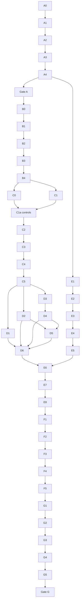

# Final Project — Autonomous Core Execution Plan

Status: **Core approved; implementation not started.**

This file converts [`DESIGN.md`](DESIGN.md) into executable work. It is the task
tracker for an implementation agent; `DESIGN.md` remains authoritative for every
technical decision, metric, acceptance threshold, and deliverable contract.

If PLAN and DESIGN ever disagree, stop and resolve the documents. Do not choose
one silently.

---

## 1. Document hierarchy and agent protocol

Read in this order:

1. [`README.md`](README.md) — project orientation, scope, and entry points.
2. [`DESIGN.md`](DESIGN.md) — complete technical and submission specification.
3. This file — task order, dependencies, outputs, and gates.
4. The newest `Handoff/HANDOFF_*.md` — current session state and deviations.

The executing agent must follow these rules:

- use the dedicated `gx10` host for Phases A-E and G, including all data work,
  training, C++ work, shutter emulation, tests, dry runs, and deliverable builds;
- use the rented Raspberry Pi 5 only for Phase F target-hardware verification
  and final measurements; never present `gx10` timings as Pi results;
- keep bobcat as the primary graded target while implementing generic target-set
  configuration over the 14 animal outputs; `car` and `empty` are not targets;
- work only on Core until Gate G passes;
- the only permitted post-Core Stretch is crop-teacher KD;
- mark a task complete only when its listed artifact exists and its checks pass;
- preserve commands, configs, logs, raw predictions, and raw timings;
- never reconstruct slide/report numbers manually;
- never evaluate models or make decisions from cis-test/trans-test labels before
  the freeze task; mechanical manifest/schema audits are allowed;
- use validation data for model/runtime/thread decisions;
- stop at a failed gate and fix the cause before continuing;
- keep all paths and commands non-interactive and rerunnable;
- update this plan and the newest handoff at the end of each work session.

### Completion states

- `[ ]` not started;
- `[~]` in progress;
- `[x]` completed and verified;
- `[!]` blocked, with the reason and evidence recorded in the newest handoff.

Do not use `[x]` for a partial implementation.

---

## 2. Fixed scope and critical path

Core is one full-frame MobileNetV2 with 16 outputs and a generic configurable
target policy, exported to ONNX and executed by a C++ ONNX Runtime application on
a Raspberry Pi 5. Bobcat remains the primary calibrated and graded target; target
selection never loads or runs another neural network.

Optimization candidates:

- M0 — FP32 baseline;
- M1 — INT8 PTQ;
- M2 — INT8 QAT;
- M3 — structured-pruned FP32;
- M4 — structured-pruned + QAT.

Dependency overview:

A4 implements the minimal interfaces later hardened by E1-E5 against trained M0
and the optimized shortlist. No Pi bundle is frozen before D6 produces the
complete deployable shortlist.

---

## 3. Phase A — repository and toolchain

### A0 — Record starting state

- [ ] Confirm access to the dedicated `gx10` working copy and capture
      `git status`, current branch/commit, disk space, CPU/GPU, ARM64 architecture,
      OS, CUDA, compiler, and available persistent-job mechanism.
- [ ] Preserve unrelated user changes.
- [ ] Create a dated run/session log.

**Output:** `results/provenance/project_start.json` and newest handoff update.

### A1 — Create repository skeleton

Depends on: A0.

- [ ] Create the package, configs, C++ directories, scripts, tests, notebooks,
      data-manifest directories, artifact directories, results, report, slides,
      demo, and deployment directories specified by DESIGN §14.
- [ ] Add `.gitignore` rules for datasets, caches, credentials, build outputs,
      large checkpoints, and temporary benchmark files.
- [ ] Add placeholder `SUBMISSION.md`, `CITATION.cff`, license, and artifact/data
      READMEs.
- [ ] Establish Python and C++ test commands.

**Done when:** a clean checkout has an understandable structure and empty test
suites execute successfully.

### A2 — Reproducible environments

Depends on: A1.

- [ ] Define the isolated `gx10` Python/GPU training environment.
- [ ] Define the `gx10` CPU-only C++/ONNX Runtime development environment.
- [ ] Define a clean target-compatible ARM64 container on `gx10` for Pi build,
      bundle-install, and full dry-run checks.
- [ ] Pin compiler, CMake, OpenCV, ONNX, ONNX Runtime, and Python dependencies.
- [ ] Add environment-capture tooling and resolved run-config serialization.
- [ ] Add checkpoint/resume and persistent logging for every long-running job.
- [ ] Verify no secret, SSH key, token, or dataset credential is committed.

**Outputs:** lockfile(s), environment setup scripts, and environment JSON schema.

### A3 — P0 toolchain spike

Depends on: A2.

- [ ] Export ImageNet-pretrained MobileNetV2 FP32 to ONNX.
- [ ] Create a small static PTQ ONNX model.
- [ ] Run one epoch/minimal step of the planned QAT path and export deployable
      INT8 ONNX.
- [ ] On `gx10`, load all three models with the exact planned C++ ORT build
      inside the target-compatible ARM64 environment.
- [ ] Run a fixture and save ORT profiles/operator coverage.
- [ ] Pin versions only after FP32/PTQ/QAT all work end to end.

**Output:** P0 evidence that all three model forms execute in ARM64 C++ and the
QAT artifact is genuinely quantized.

### A4 — Mandatory early C++ vertical slice

Depends on: A3. This task implements the minimal smoke subset of E1-E5.

- [ ] Export a deterministic 16-output smoke model and class map.
- [ ] Run saved JPEG -> C++ decode/preprocess -> ORT -> generic policy ->
      `SHUTTER_TRIGGER` JSON.
- [ ] Produce schema-valid per-stage benchmark JSON and system-monitor output.
- [ ] Build and install a provisional ARM64 deployment bundle in the clean
      target-compatible environment.
- [ ] Preserve the exact command, output, ORT profile, and bundle checksum.

**Gate A:** P0 passes and the thin C++ inference/benchmark/deployment path works
end to end before data preparation or long training.

---

## 4. Phase B — data

### B0 — Acquire and fingerprint sources

Depends on: Gate A.

- [ ] Download official CCT-20 split metadata.
- [ ] Download the downsized CCT-20 images.
- [ ] Download full-CCT image-level metadata for empty-supplement selection.
- [ ] Record URLs, timestamps, file sizes, and SHA-256 hashes.
- [ ] Verify licensing/citation text for README/report/model card.

**Outputs:** `data/README.md`, source manifest, and checksums.

### B1 — Build official split manifests

Depends on: B0.

- [ ] Parse train, cis-val, cis-test, trans-val, and trans-test JSON.
- [ ] Freeze the exact 16-class order in `configs/data/classes.yaml`.
- [ ] Assert the class set is 14 animals plus `car` and `empty`; mark only the 14
      animal classes as selectable policy targets.
- [ ] Emit deterministic JSONL manifests with complete `labels`, optional
      `primary_label`, location, sequence, dimensions, and source metadata.
- [ ] Reconcile counts to 13,553 / 3,484 / 15,827 / 1,725 / 23,275.
- [ ] Fingerprint the official train/cis-val overlap as exactly 224 sequences,
      270 cis-val images, and 10 bobcat images.
- [ ] Generate immutable `cis_val_clean.jsonl` with 3,214 images / 144 bobcat
      images by removing every train-overlapping `seq_id`.

**Outputs:** five versioned manifests plus category/location summaries.

### B2 — Build `cct_empty_train_v1`

Depends on: B1.

- [ ] Extract all 20 CCT-20 location IDs.
- [ ] Select exactly 5,000 full-CCT `empty` images from locations disjoint from
      all 20, stratified across locations/sequences with seed 42.
- [ ] Download selected images only.
- [ ] Compute image checksums and emit the supplement manifest.
- [ ] Confirm no selected image ID, sequence, or location leaks into CCT-20.

**Output:** frozen `cct_empty_train_v1.jsonl` and checksums.

### B3 — Implement data and preprocessing code

Depends on: B1, B2.

- [ ] Implement dataset readers and manifest validation.
- [ ] Exclude the seven distinct-class multi-label train images from CE while
      retaining full label sets for target-presence evaluation.
- [ ] Implement canonical aspect-preserving resize/pad/RGB/NCHW/ImageNet
      normalization from DESIGN §5.5.
- [ ] Implement training-only photometric augmentation without animal-removing
      crops.
- [ ] Make validation/test preprocessing deterministic.
- [ ] Add unit tests for manifests, labels, missing/corrupt files, and transforms.

**Output:** tested Python data package and resolved data config.

### B4 — Data audit gate

Depends on: B3.

- [ ] Implement every assertion in DESIGN §5.3.
- [ ] Produce class, location, sequence, split, and supplement statistics.
- [ ] Verify multi-label counts 7 / 0 / 1 / 61 / 9 across the five official
      splits and test target-presence semantics.
- [ ] Render/inspect representative RGB, IR-like, empty, bobcat, small, portrait,
      and landscape samples.
- [ ] Complete and execute `notebooks/01_data_audit.ipynb` from a clean kernel.
- [ ] Store machine-readable audit output and figures.

**Gate B:** every DESIGN §5.3 count, known-overlap fingerprint, clean-split,
category, multi-label, ID/sequence/location, path, and hash assertion passes. No
model training begins before Gate B.

---

## 5. Phase C — FP32 baseline M0

### C0 — Golden preprocessing fixtures

Depends on: Gate B.

- [ ] Select at least 20 validation fixtures covering edge cases.
- [ ] Freeze raw image hashes and preprocessing metadata; tensor shapes remain
      provisional until C1a selects the input contract.

**Output:** frozen raw fixture set.

### C1 — Model and training engine

Depends on: Gate B.

- [ ] Implement ImageNet-pretrained MobileNetV2 width 1.0 with configurable fixed
      input shape and 16 outputs (14 animals + `car` + `empty`).
- [ ] Implement effective-number weighted cross-entropy and persist its numeric
      class-weight vector.
- [ ] Implement two-phase head/full fine-tuning, checkpointing, early stopping,
      history logging, and run provenance.
- [ ] Implement cis-val-clean/trans-val frame and sequence-balanced target metrics,
      support-aware macro F1, multi-label presence semantics, and selection score.
- [ ] Add unit and smoke tests.

**Output:** tested training/evaluation engine and M0 config.

### C1a — Data and input controls

Depends on: C0, C1.

- [ ] Run the matched no-empty 15-output versus 5k-empty 16-output ablation from
      DESIGN §5.2 and record cis/trans empty false-fire effects.
- [ ] Run the matched 224x224 versus 256x192 aspect-preserving input control.
- [ ] Select/freeze the Core input using cis-val-clean/trans-val target metrics,
      real-pixel utilization, and MACs; prefer 256x192 when statistically tied.
- [ ] Permit 320x240 only if both planned inputs fail the bobcat-recall rule.
- [ ] Generate canonical Python golden tensors for the selected input shape and
      freeze their hashes.

**Output:** `results/ablations/data_input_decision.md`, frozen preprocessing config,
and completed golden fixture set.

### C2 — Train primary baseline

Depends on: C1a.

- [ ] Train seed 42 on gx10.
- [ ] Save best/last checkpoints and optimizer/scheduler state.
- [ ] Save full history, resolved config, environment, dataset/model hashes, and
      validation logits/predictions.
- [ ] Verify the selected checkpoint follows the configured rule.

**Output:** complete M0 seed-42 run directory.

### C3 — Calibrate and evaluate validation operating point

Depends on: C2.

- [ ] Search thresholds using cis-val-clean and trans-val only.
- [ ] Apply the two-domain 90% sequence-balanced recall rule from DESIGN §6.3.
- [ ] Bootstrap `seq_id` clusters and save the threshold distribution/95% interval.
- [ ] Save `artifacts/policies/bobcat_v1.yaml` bound to class map/model hash.
- [ ] Implement the versioned generic policy schema with `mode: any`, non-empty
      unique animal targets, per-class thresholds, and model/class-map hashes;
      reject `car` and `empty` as wildlife targets.
- [ ] Produce validation precision/recall/F2/false-fire/fire-rate results and score
      distributions.

**Output:** versioned M0 bobcat policy, generic policy schema, and validation
report.

### C4 — Export and parity

Depends on: C3, C0.

- [ ] Export FP32 ONNX with fixed input/output contract and metadata.
- [ ] Pass P1 preprocessing parity against the reference C++ preprocessor.
- [ ] Pass P2 PyTorch-vs-ORT FP32 parity.
- [ ] Pass initial ORT Python-vs-C++ fixture parity.
- [ ] Save parity tolerances, raw comparisons, hashes, and failures if any.

**Output:** deployable M0 ONNX and parity report.

### C5 — Reproducibility confirmation and model card

Depends on: C4.

- [ ] Train confirmation seeds 17 and 73.
- [ ] Report validation mean/std for baseline training variability.
- [ ] Complete M0 model card: data, intended use, limitations, preprocessing,
      metrics, policy, license, and hashes.
- [ ] Add the M0 row to the machine-readable comparison table.

**Gate C:** M0 is reproducible, exported, parity-checked, calibrated, documented,
and ready for the same Pi application as optimized candidates.

---

## 6. Phase D — optimization ladder

### D1 — M1 INT8 PTQ

Depends on: Gate C.

- [ ] Build the fixed 1,024-image calibration manifest from training data only.
- [ ] Generate MinMax, Entropy, and Percentile static INT8 candidates.
- [ ] Inspect QDQ/QOperator coverage and remaining FP32 nodes.
- [ ] Record the pre-registered MobileNetV2 PTQ risk before viewing results.
- [ ] Run quantization debugging for material accuracy drops.
- [ ] Calibrate candidate-specific bobcat policies on validation.
- [ ] Pass P3/P4 quantized ORT/C++ validation for the selected M1 candidate.

**Output:** selected M1 model, policy, profile, metrics, and comparison row.

### D2 — M2 INT8 QAT

Depends on: Gate C, A3.

- [ ] Initialize from M0 FP32, never from M1 PTQ.
- [ ] Run the validated affine INT8 fake-quant/QAT recipe.
- [ ] Search only the documented low learning-rate range on validation.
- [ ] Export a genuinely quantized ONNX graph.
- [ ] Inspect integer operator coverage/profile.
- [ ] Calibrate policy and pass P3/P4.

**Output:** selected M2 model, policy, profile, metrics, and comparison row.

### D3 — Pruning sensitivity

Depends on: Gate C.

- [ ] Adapt `hw1/src/structured.py` to the frozen MobileNetV2 input, residual/
      depthwise dependency groups, 16 outputs, and bobcat validation metrics.
- [ ] Profile M0 parameters/MACs.
- [ ] Produce sensitivity evidence for dependency groups.
- [ ] Add pruning correctness tests.

**Output:** sensitivity report and reproducible pruning config.

### D4 — M3 structured-pruned FP32

Depends on: D3.

- [ ] Create approximately 15%, 30%, and 45% MAC-reduction candidates.
- [ ] Physically remove channels and verify changed shapes/MACs.
- [ ] Fine-tune each under the fixed data/loss contract.
- [ ] Export and parity-check deployable candidates.
- [ ] Calibrate policies and add all validation rows.
- [ ] Select one M3 point for M4 using the validation Pareto frontier.

**Output:** M3 candidate set, selected checkpoint, models, policies, and evidence.

### D5 — M4 structured-pruned + QAT

Depends on: D4, D2.

- [ ] Apply the validated QAT recipe to the selected M3 FP32 checkpoint.
- [ ] Export, profile, calibrate, and pass P3/P4.
- [ ] Add M4 to the comparison table without assuming it is the winner.

**Output:** M4 model, policy, profile, metrics, and comparison row.

### D6 — Freeze deployable pre-Pi shortlist

Depends on: D1, D2, D4, D5.

- [ ] Reject any candidate failing correctness/export/parity gates.
- [ ] Apply DESIGN §8.5 validation selection rules.
- [ ] Use `gx10` latency only to detect float fallback/pathologies, never to rank
      Cortex-A76 candidates.
- [ ] Remove candidates dominated on validation bobcat F2, MACs, and model size.
- [ ] Write `results/model_selection/pre_pi_shortlist.md`, including every
      rejection and all non-dominated deployable candidates.
- [ ] Freeze models, candidate-specific bobcat policies, preprocessing, class map,
      and hashes for Pi validation; keep test labels sealed.

**Gate D:** M0 and the complete deployable optimized shortlist are frozen for Pi
validation. No final optimized winner has been selected using `gx10` latency.

---

## 7. Phase E — C++ application and deployment bundle

### E1 — C++ project foundation

Depends on: A4; harden the smoke implementation using M0.

- [ ] Replace the 145-line course smoke test with a C++17 application/library
      structure, tests, configuration, and CLI.
- [ ] Implement RAII/error/logging conventions and deterministic JSON schemas.
- [ ] Pin the ORT CPU EP build and compiler flags.
- [ ] Prefer one proven official ONNX Runtime Linux AArch64 artifact for the clean
      `gx10` target environment and Pi; fall back to pinned source build only if
      P0 proves the artifact incompatible.

### E2 — Preprocessing

Depends on: E1, C0; smoke path is provisional until C1a freezes the input.

- [ ] Implement correct reference preprocessing.
- [ ] Implement fused/preallocated preprocessing.
- [ ] Pass golden tensor fixtures for both paths.
- [ ] Reject the old BGR-as-RGB behavior.

### E3 — Model session and policy

Depends on: E1, C4.

- [ ] Implement model contract validation and ORT session/thread configuration.
- [ ] Implement class-map/model-hash-bound loading of one or more target classes,
      each with its own threshold; Core combination semantics are `mode: any`.
- [ ] Implement `SHUTTER_TRIGGER=0/1` output with selected scores and passing
      targets in the structured inference result.
- [ ] Add single-target, multi-target, exact-boundary, `car`/`empty`/duplicate/
      unknown target, unsupported-mode, wrong-model, class-map, and threshold tests.

### E4 — Dataset runner

Depends on: E2, E3.

- [ ] Consume manifests deterministically.
- [ ] Emit ordered JSONL scores, classes, decisions, errors, and stage timings.
- [ ] Preserve complete label sets and match multi-label target-presence metrics.
- [ ] Define corrupt/missing-image behavior.
- [ ] Match Python validation outputs and confusion matrix.

### E5 — Benchmark and system monitor

Depends on: E4.

- [ ] Implement warm-up, repetitions, p50/p95/p99, inference/end-to-end FPS, and
      per-stage timings.
- [ ] Implement peak RSS and CPU-utilization capture.
- [ ] Capture available frequency/temperature/throttling signals and explicit
      `unavailable` values.
- [ ] Validate output schemas and percentile calculations.
- [ ] Report whether Pi p95 end-to-end meets the primary 200 ms / 5 FPS target
      and the aspirational 100 ms / 10 FPS target; do not treat them as measured
      until Phase F.

### E6 — Correctness and C++ optimization experiment

Depends on: E5, Gate D.

- [ ] Pass P1-P4 for M0 and every shortlisted optimized model.
- [ ] Measure reference-vs-fused preprocessing with model/config held constant.
- [ ] Compare full JPEG decode against reduced 1/2 and 1/4 decode; test 1/8 only
      with explicit validation accuracy/decision-drift evidence.
- [ ] Measure supported ORT graph levels, threads 1/2/4, memory arena on/off, and
      stable CPU affinity if exposed; change one factor at a time.
- [ ] Keep reduced decode only if validation bobcat metrics meet the predeclared
      tolerance; it is not preprocessing parity.
- [ ] Run Python-vs-C++ validation dataset parity.
- [ ] On `gx10`, run all unit/integration/self-tests under both a clean native
      CPU-only build and the target-compatible ARM64 build.

**Gate E6:** the C++ application is correct before performance claims are made.

### E7 — Raspberry Pi deployment bundle

Depends on: E6.

- [ ] Package C++ executable, required runtime/install instructions, M0 and every
      shortlisted ONNX model/policy, class map, validation benchmark/parity subset,
      sample images, `install.sh`, `run_demo.sh`, and checksums.
- [ ] Generate bundle manifest with commit/model/policy hashes.
- [ ] Test installation in a clean target-compatible container on `gx10` without
      access to the host training environment or unbundled artifacts.
- [ ] If binary compatibility cannot be proven, include pinned source/build
      automation and make Pi-side compilation part of `install.sh`.

**Output:** versioned ARM64 deployment archive.

### E8 — Full ARM64 dry run

Depends on: E7.

- [ ] On `gx10`, run the exact future Pi provision/install/demo/benchmark
      commands inside the target-compatible ARM64 environment.
- [ ] Verify unattended execution and machine-readable outputs.
- [ ] Verify baseline is included in the measurement matrix.
- [ ] Copy and parse results using the reporting code.
- [ ] Record a known-good dry-run log for later diffing.

**Gate E:** the deployment bundle and one-command benchmark work end to end. Do
not rent the Pi before this gate.

`gx10` dry-run latency is diagnostic only. Phase F remains mandatory because
only measurements produced on the rented Pi 5 count as target-hardware evidence.

---

## 8. Phase F — five-day rented Raspberry Pi 5 trial

### F1 — Day 1: provision and smoke test

- [ ] Use `gx10` as the control/evidence host and verify the remote Pi connection.
- [ ] Record hardware/OS/kernel/governor/compiler/ORT/OpenCV/environment.
- [ ] Record exposed frequency, temperature, and throttling interfaces.
- [ ] Install the frozen bundle.
- [ ] Run self-test and a short validation smoke test.
- [ ] Do not tune models or inspect test labels.

### F2 — Day 2: validation performance profiling

Depends on: F1.

- [ ] Run the same fixed validation benchmark for M0 and every shortlisted model.
- [ ] Measure the bounded decode/preprocessing/ORT/thread/runtime matrix from E6.
- [ ] Run ORT/C++ profiles and identify bottlenecks; do not open test labels.
- [ ] Make only safe runtime fixes validated against parity tests.

### F3 — Day 3: repeat validation and freeze

Depends on: F2.

- [ ] Repeat validation after any safe fix.
- [ ] Select the final optimized model using validation accuracy, real Pi latency,
      model size, and simplicity; write `final_decision.md`.
- [ ] On `gx10`, train confirmation seeds 17/73 for the selected transformation
      with frozen hyperparameters; these measure variability and do not replace
      the seed-42 deployment artifact.
- [ ] Calibrate a final-model threshold catalog for all 14 animals; flag classes
      lacking support, generate the bobcat policy and validated
      `bobcat_coyote_v1.yaml`, and record combined validation false-fire metrics.
- [ ] Freeze git commit, binary, selected model, policies, preprocessing/decode
      mode, ORT options, and thread count.
- [ ] Archive freeze manifest before test evaluation.

**Freeze gate:** no artifact or configuration changes after this point.

### F4 — Day 4: frozen full test and Pi benchmark

Depends on: F3.

- [ ] On `gx10`, run full frozen cis-test and trans-test through the exact C++/ORT
      model/policy/runtime artifacts; save frame and sequence-aware metrics.
- [ ] Run full M0-vs-optimized Pi benchmark, at least 1,000 frames, three separate
      processes/repetitions as specified.
- [ ] Run the fixed Pi parity subset and match decisions to the frozen gx10
      reference; full test transfer to Pi is optional, not required.
- [ ] Capture raw per-frame predictions/timings/system logs.
- [ ] Copy artifacts off the Pi immediately.

### F5 — Day 5: unchanged reproducibility repeat

Depends on: F4.

- [ ] Repeat the frozen Pi benchmark/parity run without changes.
- [ ] Compare runs and investigate only measurement anomalies, without tuning.
- [ ] Back up every result, log, environment file, binary, and model.
- [ ] Copy and checksum all raw Pi evidence back to `gx10`.
- [ ] Verify result schemas and hashes before the trial expires.

**Gate F:** baseline and optimized Pi evidence contains latency, FPS, RSS, CPU
utilization, model size, available thermal/frequency data, parity, and raw
repetitions under a frozen protocol; full frozen test accuracy exists from gx10.

---

## 9. Phase G — analysis, public release, and submission

### G1 — Freeze analysis dataset

Depends on: Gate F.

- [ ] Validate and index all raw training/evaluation/parity/Pi result files.
- [ ] Create a machine-readable canonical results table.
- [ ] Record missing/unavailable fields explicitly.

### G2 — Results notebook and figures

Depends on: G1.

- [ ] Complete and clean-run `notebooks/02_results_analysis.ipynb`.
- [ ] Generate every table/figure required by DESIGN §17.
- [ ] Compute sequence-bootstrap metric/threshold intervals, support-aware macro
      F1, official-vs-clean cis-val effects, and per-location trans recall.
- [ ] Report multi-label exclusions for confusion/macro metrics and retain those
      images in target-presence metrics.
- [ ] Select representative failure cases without hiding negative results.

### G3 — Final report

Depends on: G2.

- [ ] Write all sections specified by DESIGN §15.
- [ ] Include public repository/release placeholders and later replace them.
- [ ] Separate measured, published, and estimated values.
- [ ] Include what worked, what failed, bottlenecks, limitations, and next steps.
- [ ] Export and visually inspect `final_report.pdf`.

### G4 — Slide deck

Depends on: G2, G3.

- [ ] Create the 10-12 slide narrative from DESIGN §16.
- [ ] Include repository URL and QR on first/final slides.
- [ ] Include result units, sample counts, run/commit identity, and limitations.
- [ ] Export PDF and visually inspect every slide.
- [ ] Rehearse explanations for C++, pruning, quantization, thresholds, and every
      headline number.

### G5 — Public repository and submission manifest

Depends on: G3, G4.

- [ ] Clean README quick start and reproduction commands.
- [ ] Publish code without secrets/data archives.
- [ ] Publish models/deployment bundle through GitHub Release or LFS.
- [ ] Verify checksums/download links from a clean environment.
- [ ] Tag `v1.0-final` and record the commit hash.
- [ ] Replace every `REPO_URL`/`RELEASE_URL` placeholder.
- [ ] Complete `SUBMISSION.md` with canonical links and commands.
- [ ] Run every Definition of Done item in DESIGN §19.

**Gate G:** the complete Core submission is public, reproducible, visually
checked, and every headline number traces to raw machine-readable evidence.

---

## 10. Optional Phase S — crop-teacher KD

This phase is locked until Gate G. It must not alter the frozen Core release.

### S1 — crop data and teacher

- [ ] Build GT-crop manifests using train boxes only.
- [ ] Define and test multi-box/padding behavior.
- [ ] Train a 15-non-empty-class crop teacher (14 animals + `car`).

### S2 — fair control and KD

- [ ] S0: reproduce Core FP32 student budget.
- [ ] S1: crop augmentation without teacher.
- [ ] S2: cross-view KD with identical student initialization/budget.
- [ ] Apply KD only to non-empty samples and align all 15 non-empty logits.

### S3 — decision

- [ ] Report KD as successful only if S2 beats S1.
- [ ] Preserve a null result if it does not.
- [ ] Publish Stretch as a separate config/result/release addition.

---

## 11. Session handoff template

At the end of each implementation session, create a new dated handoff containing:

- tasks completed and gates passed;
- exact runs/models/artifacts created;
- commands and environment used;
- failures and diagnostic evidence;
- current git status and whether changes are committed/pushed;
- next unblocked task ID from this plan;
- decisions that changed DESIGN/PLAN and why;
- external state required next, such as gx10 or Pi credentials.

The next session starts from the newest handoff and verifies the filesystem before
trusting prose.
