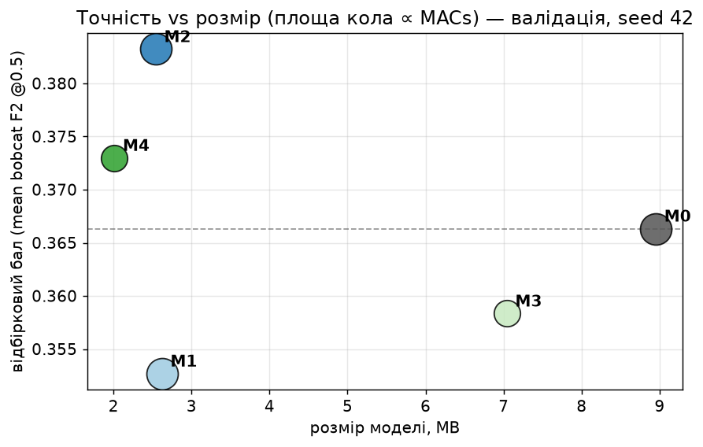
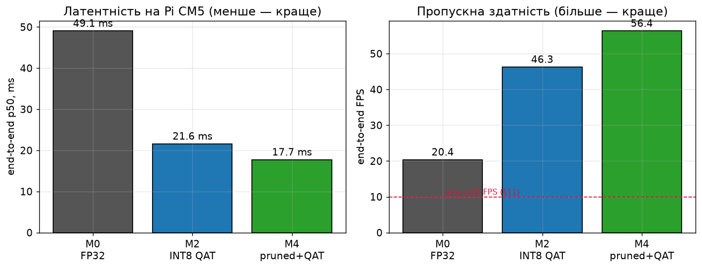
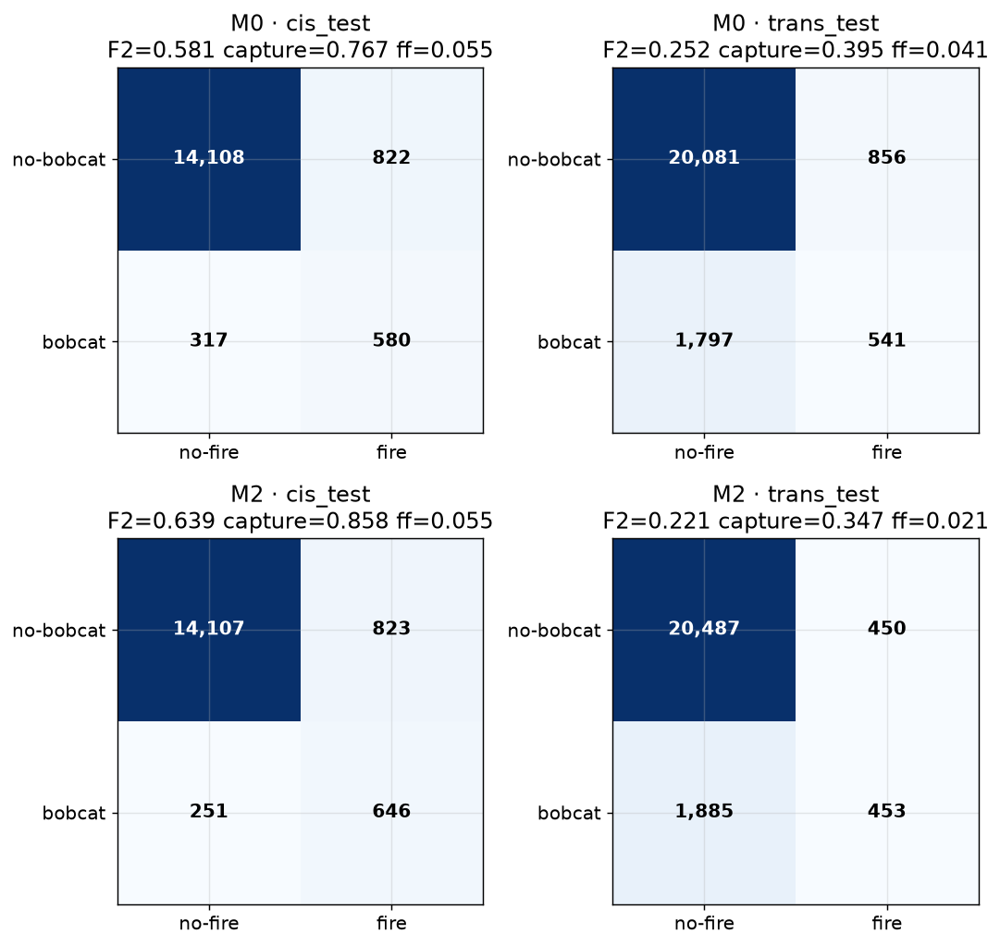
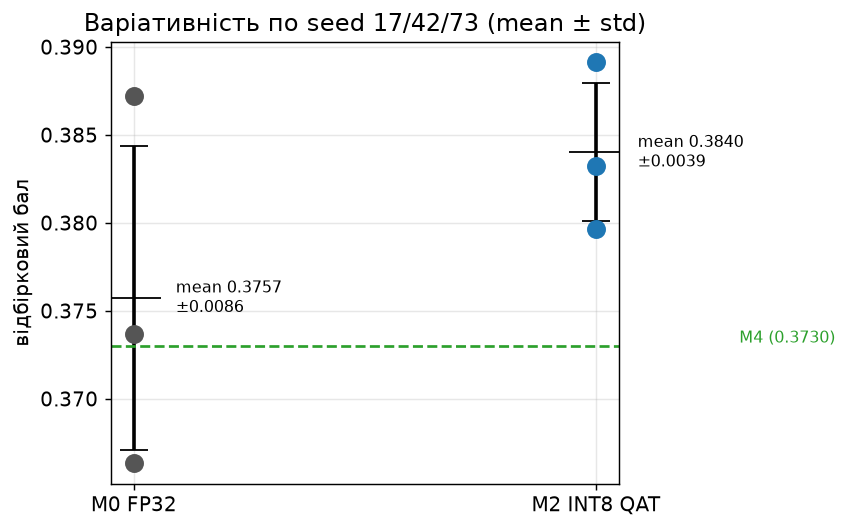
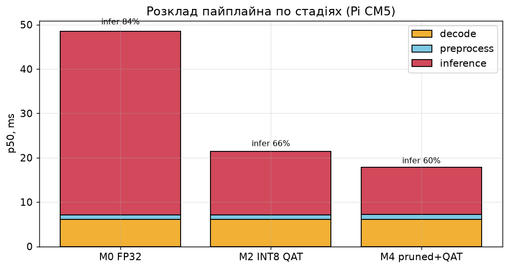
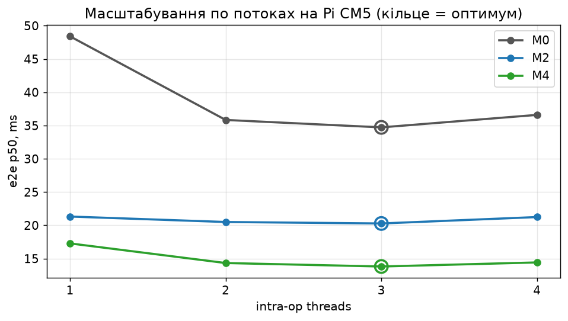
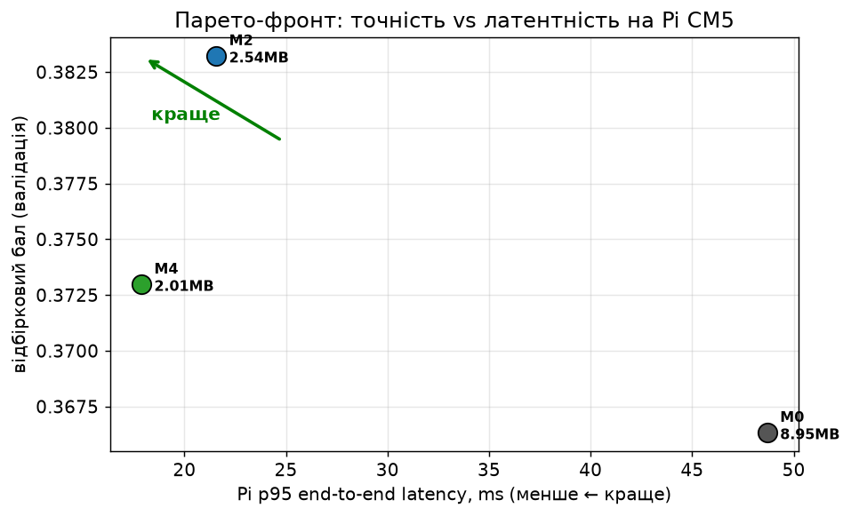
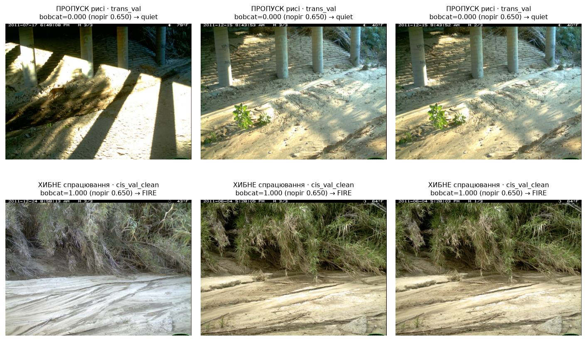

<!-- Numbers in this report are generated from results/analysis/canonical_results.json and the
raw result files; none is typed from memory (DESIGN §9.2). Figures are the exact PNGs the G2
notebook (notebooks/02_results_analysis.ipynb) produced under results/analysis/figures/. -->

## 1. Problem and product narrative

A wildlife photographer wants the camera shutter to fire **only when a target animal — a
bobcat (*Lynx rufus*) — walks into frame**, and to stay quiet the rest of the time so the
photographer is not buried in empty-frame and wrong-species exposures. The device is a
**Raspberry Pi**: it runs offline in the field, on battery, with no cloud. The core engineering
artifact is therefore a **CPU-only C++ inference engine** that classifies a saved frame and emits
an (emulated) `SHUTTER_TRIGGER` when the target's confidence clears a calibrated threshold.

The product constraint that shapes everything is **latency and size on the target hardware**:
the model must run fast enough to keep up with a camera-trap burst and small enough to ship on a
Pi. This project takes a MobileNetV2 baseline and drives it down the optimization ladder
(quantization + pruning), measures the payoff **on a real Raspberry Pi**, and reports the result
honestly — including where it falls short.

## 2. Course objective and engineering question

The assignment is to **prepare, port, and optimize a neural network for on-device inference on a
Raspberry Pi**, establish a baseline, and improve frames-per-second through model- and
inference-level optimization, with the deployed engine written in C++.

**Engineering question:** *how much on-device speedup can disciplined INT8 quantization and
structured pruning buy for a MobileNetV2 wildlife classifier on a Raspberry Pi 5-class device —
and does it cost accuracy?* The short answer, measured on real hardware: **2.27× faster and 3.5×
smaller at equivalent accuracy** (in fact slightly better in-distribution).

## 3. Dataset, splits, empty supplement, and leakage controls

We use **Caltech Camera Traps CCT-20** (57,864 images, 16 classes = 14 animals + `car` + `empty`),
with the official cis/trans split structure. **Bobcat is the graded target**; the class order is
frozen as ascending CCT category id (`configs/data/classes.yaml`), which places bobcat at index 3.

Three leakage controls, each measured rather than assumed:

- **Official train/cis-val sequence overlap** is fingerprinted at exactly 224 sequences /
  270 images / 10 bobcat images. All development decisions use **`cis_val_clean`** (3,214 images /
  144 bobcat), which removes every train-overlapping sequence; the official split is preserved and
  both are reported.
- **Empty supplement `cct_empty_train_v1`** (5,000 `empty` frames, seed 42) is drawn from CCT
  locations **disjoint** from all 20 CCT-20 cameras on id, sequence, and location, and **downsized
  to ≤1024 px** to match the `_sm` archive — otherwise resolution would be a shortcut for `empty`.
  The **supplement-vs-CCT-20 shortcut probe scores 0.5775** (chance 0.50), below the 0.60
  attention threshold, so the removable resolution confound is closed.
- **Multi-label frames** (7 in train) are excluded from cross-entropy but retained for
  target-presence evaluation.

The input geometry is **256×192** (not 224×224): at −2.0 % MACs it carries **+31.1 % real pixels**
(97.5 % vs 72.8 % utilization) because CCT's dominant frame is 1024×747, and libjpeg scales
1024→256 during decode so no resize is needed. Gate B passed 43/43.

## 4. MobileNetV2 baseline and training recipe

**M0** is ImageNet-pretrained MobileNetV2 (width 1.0) with a 16-output head, input 256×192, trained
with **effective-number-weighted cross-entropy** and two-phase head→full fine-tuning (seed 42).
Checkpoint selection uses the pre-registered **mean bobcat F2 @ 0.5** score. The operating threshold
is then calibrated on validation under the DESIGN §6.3 rule: the largest threshold inside a **5 %
per-domain false-fire budget** that meets a 90 % sequence-balanced recall floor.

That floor is **not reachable** inside the budget for any model — C3 records
`recall_floor_infeasible` and ships the best admissible-F2 threshold. **This is a pre-registered
measurement, not a failure** (§18): the trans-domain bobcat problem is genuinely hard, and no
artifact in this project reports the constrained fallback as a satisfied rule.

## 5. PTQ, QAT, structured pruning, and theoretical expectations

The optimization ladder and its pre-registered expectations:

| Model | Transform | Expectation |
|---|---|---|
| **M0** | FP32 baseline | reference |
| **M1** | INT8 **PTQ** | depthwise MobileNetV2 loses accuracy under PTQ — keep as a negative result if so |
| **M2** | INT8 **QAT** | recover PTQ's loss by training the fake-quant graph |
| **M3** | structured **pruning** (FP32) | fewer MACs; may **not** speed up if widths break SIMD alignment |
| **M4** | pruned + QAT | compound size/latency wins |

Two findings that cost real engineering time and belong in "what did not work as expected":

- **QDQ placement, not the QAT library, is what matters.** The first QAT attempt produced a float
  graph carrying rounded weights (only 2/52 convolutions quantized) because ORT's float-level
  `Conv+Clip→FusedConv` fusion fires before the QDQ rule can match `DQ→Conv→Q`. Fixing the QDQ
  placement — output-side quantization, ReLU6 absorbed exactly into the activation quantizer
  (measured at 0.0 difference), the classifier's flattened input quantized — made all 52
  convolutions run integer. ORT also **requires rank-0 QDQ scales**; torch exports shape `[1]` and
  `onnx.checker` passes it, so a structural repair (`optimize/qdq_scalar.py`) was needed.
- **Pruning widths were rounded to multiples of 8** first, so that a null speed result would be a
  statement about the architecture, not about unaligned SIMD lanes. M3/M4 realize a **30 % MAC
  reduction** (293→206 M) and a 21.5 % parameter reduction.

Validation ranking (mean bobcat F2 @0.5): M0 0.3663 / M1 0.3527 / **M2 0.3832** / M3 0.3583 /
M4 0.3730. M1 (PTQ) is the pre-registered negative result. M2 (QAT) is the most accurate.

## 6. C++ application and correctness/parity tests

The deployed engine is **C++ + ONNX Runtime CPU EP**; Python is limited to training and export.
Correctness is enforced by a gate chain before any performance claim:

- **P1** — C++ preprocessing (fused and reference paths) matches the Python golden tensors
  (python↔fused 0.0, python↔reference 7e-7); BGR-as-RGB is rejected.
- **P2 / p_ort_cpp** — C++ ORT agrees with Python ORT on identical tensors.
- **P3 / P4** — the quantized graph runs the same integer kernels in Python and C++; full
  dataset run-dataset parity over validation is confusion-matrix identical with 0 hard decision
  disagreements.
- **QEMU `cortex-a76` rehearsal** — run-dataset native vs emulated is **bit-identical** for
  M0/M2/M4, predicting no Pi ISA-dispatch surprise.

The application ships one binary (`-mcpu=cortex-a76`, glibc 2.39) plus the pinned ORT; OpenCV
4.6.0 (`.406`) is apt-installed by `install.sh`. A **fail-closed preflight** refuses any host that
is not aarch64 / Ubuntu 24.04 / `asimddp` before touching the system, and writes a machine-readable
`environment.json`.

## 7. Raspberry Pi benchmark protocol

The target is a rented **Raspberry Pi Compute Module 5 (CM5, 8 GB)** — a Pi-5-class board (same
BCM2712 / Cortex-A76 @ 2.4 GHz, `asimddp`), Ubuntu Server 24.04. `gx10` (an ARM64 workstation) is
the control/evidence host; latency is only ever reported from the Pi (DESIGN §12.4).

Protocol (Phase F, one-shot rental, five days):

1. **F1** install the frozen bundle + smoke test; record host/governor/thermal.
2. **F2** validation performance profiling (thread/decode/graph/arena matrix).
3. **F3** select + **freeze** the final model, threshold catalog, runtime config.
4. **F4** benchmark M0-vs-optimized (≥1000 iters × 3 processes) + open the sealed test **once** +
   Pi↔gx10 parity subset.
5. **F5** unchanged reproducibility repeat.

Benchmarks pin the `performance` governor (a documented DVFS control) with no thermal throttling
(`throttled=0x0`). Gate F **PASSED**.

## 8. Accuracy and system-performance results

### On-device latency (real Pi CM5, frozen config threads=1, 3 reps)

| Model | Precision | Size | decode/preproc/infer ms | e2e p50 | FPS | Peak RSS | Speedup |
|---|---|---:|---|---:|---:|---:|---:|
| M0 | FP32 | 8.95 MB | 6.0 / 1.0 / 41.3 | **49.06 ms** | 20.4 | 96.5 MB | 1.00× |
| **M2** | INT8 QAT (**final**) | 2.54 MB | 6.0 / 1.0 / 14.3 | **21.61 ms** | **46.3** | 89.1 MB | **2.27×** |
| M4 | INT8 pruned+QAT | 2.01 MB | 6.1 / 1.1 / 10.6 | 17.74 ms | 56.4 | 82.2 MB | 2.77× |

### Frozen full-test accuracy (test set opened once, frozen threshold)

`cis_test` 15,827 frames (897 bobcat), `trans_test` 23,275 frames (2,338 bobcat):

| Model | Split | frame F2 | seq-bal recall | **event capture** | false-fire |
|---|---|---:|---:|---:|---:|
| M0 | cis_test | 0.5812 | 0.6636 | 0.7668 | 0.0551 |
| M0 | trans_test | 0.2517 | 0.2919 | 0.3952 | 0.0409 |
| **M2** | cis_test | **0.6387** | **0.7604** | **0.8575** | 0.0551 |
| **M2** | trans_test | 0.2209 | 0.2621 | 0.3468 | 0.0215 |

**In-distribution, the INT8 model beats the FP32 baseline** (F2 0.6387 vs 0.5812; captures 85.8 %
of bobcat visits vs 76.7 % at equal false-fire) — quantization did not cost accuracy, it slightly
helped. New-location performance is poor for both (see §11).

### Parity and reproducibility

**Pi↔gx10 decisions are bit-identical** for both M0 and M2 (max score Δ 0.0, 0 decision
disagreements) — so the gx10 test accuracy transfers to the Pi exactly. F4 vs F5 latency is
reproducible within **±3.5 %** (M0 −0.8 %, M2 +3.5 %, M4 −2.0 %). Confirmation seeds 17/42/73 give
M2 a mean score of **0.3840 ± 0.0039**, tighter than M0's 0.3757 ± 0.0086.

## 9. Ablation and Pareto analysis

Inference dominates the FP32 pipeline (**85 %**, 41.3 ms) and collapses **4.0×** to 10.6 ms for M4,
so the bottleneck shifts from the model to the fixed ~6 ms JPEG decode.

On the 4-core A76, **`threads=3` is optimal for all three models** — the opposite of `gx10`
(20 cores, threads=4 regresses). Reduced JPEG decode buys only ~1.05–1.08× and was **rejected** on
accuracy (E6 decode-drift: half/quarter lose real bobcat detections). graph-opt / arena / preprocess
are within noise, confirming the shipping defaults.

The Pareto front (validation accuracy vs Pi p95 latency) shows M2 and M4 dominating M0; **M2 is
selected over M4 by the pre-registered rule** (§8.4: a more complex stack must be *more accurate*
to win, and M4 is not).

## 10. What worked well

- **INT8 QAT is the win**: 2.27× on-device speedup, 3.5× smaller, no accuracy cost (better
  in-distribution), decisions bit-identical to the FP32 reference.
- **The C++/ORT path is exact and portable**: every parity gate passed; the Ubuntu-24.04 build is
  bit-identical to the earlier Bookworm build, and the Pi matched the gx10 reference to the bit.
- **Emulation de-risked the one-shot rental**: the QEMU `cortex-a76` rehearsal correctly predicted
  bit-identical Pi behaviour, so no rental day was spent on ISA surprises.
- **Threading on the Pi** adds a further ~1.25× (measured, target-specific).

## 11. What did not work as expected

- **Trans-domain (new-location) recall is poor** — all models capture only ~35–40 % of bobcat
  visits at unseen cameras. This is the honest, reported limitation, consistent across seeds
  (§18 decision rule). The 90 % recall floor is **infeasible** inside the 5 % false-fire budget.
- **PTQ (M1) underperformed** on depthwise MobileNetV2 — the pre-registered negative result.
- **Pruning (M4) did not earn the final slot**: it is faster and smaller but not more accurate than
  M2, so the simpler QAT model ships.

## 12. Hardware/software bottlenecks

- **Inference-bound → I/O-bound.** Quantization moved the bottleneck from the model forward pass
  (85 % for FP32) to the fixed JPEG decode (~41 % of the M4 pipeline). Further latency gains lie in
  the decode path, not the model.
- **Core count changes the thread optimum**: gx10's 20 cores regress past threads=1–2 on this small
  network; the Pi's 4 cores prefer threads=3. A thread count tuned on the dev host would mis-set the
  Pi.
- **OpenCV soname coupling**: the binary links `libopencv_imgcodecs.so.406`; shipping requires the
  matching Ubuntu 24.04 apt runtime, enforced by the fail-closed preflight.

## 13. Limitations

- **Remote Pi, saved dataset**: no live camera, no GPIO shutter wiring, no power/energy measurement
  (the rented Pi has no instrumentation). The shutter is an emulated JSON signal.
- **CCT domain**: results are camera-trap-specific; trans-domain generalization to unseen sites is
  weak and is not claimed otherwise.
- **`badger`/`deer`/`fox`** have no defensible validation support and ship with null thresholds in
  the 14-entry catalog.

## 14. Concrete next steps

- **Close the decode bottleneck**: a lighter JPEG decoder or a smaller stored frame (the accuracy-
  safe part of reduced decode), now that inference is no longer dominant.
- **Improve OOD generalization**: more diverse locations, test-time augmentation, or the optional
  **crop-teacher knowledge distillation** stretch (Phase S, locked until Gate G).
- **Physical integration**: wire the emulated shutter to real GPIO and add on-device power
  measurement to report Joules-per-decision.

## 15. Reproducibility statement

Every number traces to a machine-readable result file; nothing is hand-typed
(`scripts/build_canonical_results.py` → `results/analysis/canonical_results.json`). Figures are
regenerated by `notebooks/02_results_analysis.ipynb`. The Pi trial is reproduced by
`deploy/pi/run_f4_pi_benchmark.sh`; the frozen test by `scripts/run_f4_frozen_test.sh`.

- **Public repository:** <https://github.com/imagic9/efficient-ml-set>
- **Release tag:** `v1.0-final` (see `SUBMISSION.md`)
- **Final commit:** recorded in `SUBMISSION.md` at release
- **Deployment bundle:** GitHub Release (M0/M2/M4 ONNX + policies + C++ binary + ORT)

## 16. References

- Beery, Van Horn, Perona. *Caltech Camera Traps / Recognition in Terra Incognita*, ECCV 2018.
- Sandler et al. *MobileNetV2: Inverted Residuals and Linear Bottlenecks*, CVPR 2018.
- Jacob et al. *Quantization and Training of Neural Networks for Efficient Integer-Arithmetic-Only
  Inference*, CVPR 2018.
- ONNX Runtime, quantization (QDQ) and execution-provider documentation.
- Project design and plan: `final_project/DESIGN.md`, `final_project/PLAN.md`.
